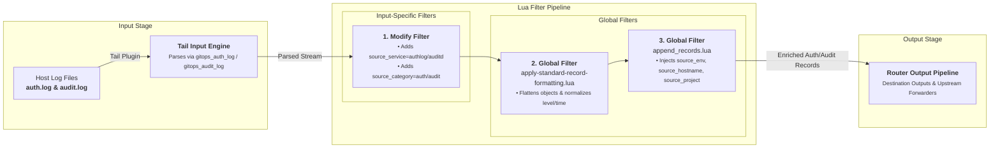

# Host Auth & Audit Log Ingestion Input

This document details host authentication (`auth.log` / `secure`) and kernel audit daemon (`audit.log`) log ingestion supported by `fluent-bit-router`.

---

## Overview

When `/host/var/log` is mounted into the container, `fluent-bit-router` automatically scans for SSH authentication logs and Linux kernel audit logs, tailing them with custom regex parsers and tagging them with appropriate metadata categories.

---

## Configuration Reference & Auto-Detection

### File Detection Triggers

| Target Path                     | Ingested Category | Enabled Input                | Parser Used        |
| ------------------------------- | ----------------- | ---------------------------- | ------------------ |
| `/host/var/log/auth.log`        | `auth`            | Auth Log Input               | `gitops_auth_log`  |
| `/host/var/log/secure`          | `auth`            | Auth Log Input (RHEL/CentOS) | `gitops_auth_log`  |
| `/host/var/log/audit/audit.log` | `audit`           | Auditd Log Input             | `gitops_audit_log` |

### Configuration Templates

#### Auth Log Pipeline Template

```yaml
pipeline:
  inputs:
    - name: tail
      tag: node.log.auth.${HOST_HOSTNAME}
      path: /host/var/log/auth.log
      parser: gitops_auth_log
      db: /var/fluent-bit/state/auth-log.db
      db.sync: normal
      refresh_interval: 10
      rotate_wait: 30
      read_from_head: On
      skip_long_lines: On
      mem_buf_limit: 20MB
      storage.type: filesystem

  filters:
    - name: modify
      match: node.log.auth.**
      add:
        source_service: authlog
        source_category: auth
```

#### Auditd Log Pipeline Template

```yaml
pipeline:
  inputs:
    - name: tail
      tag: node.log.audit.${HOST_HOSTNAME}
      path: /host/var/log/audit/audit.log
      parser: gitops_audit_log
      db: /var/fluent-bit/state/audit-log.db
      db.sync: normal
      refresh_interval: 10
      rotate_wait: 30
      read_from_head: On
      skip_long_lines: On
      mem_buf_limit: 20MB
      storage.type: filesystem

  filters:
    - name: modify
      match: node.log.audit.**
      add:
        source_service: auditd
        source_category: audit
```

---

## Ingestion & Filtering Flow Diagram



---

## Applied Parsers & Filters

### Custom Parsers (`pipeline.parsers`)

```yaml
pipeline:
  parsers:
    - name: gitops_auth_log
      format: regex
      regex: '^(?<time>[A-Z][a-z]{2}\s+[ 0-9]{1,2}\s\d{2}:\d{2}:\d{2})\s(?<host>[^ ]+)\s(?<process>[^:]+):\s(?<message>.*)$'
      time_key: time
      time_format: '%b %d %H:%M:%S'

    - name: gitops_audit_log
      format: regex
      regex: '^type=(?<audit_type>[^ ]+)\s+msg=audit\((?<time>\d+\.\d+):(?<audit_id>\d+)\):\s(?<message>.*)$'
      time_key: time
      time_format: '%s.%L'
```

### Global Core Filters

- **[`apply-standard-record-formatting.lua`](input-global-filters.md#1-core-record-formatting-filter-apply-standard-record-formattinglua)**: Decodes string JSON, normalizes `message`, flattens nested objects, converts `source.` keys to `source_`, and normalizes level/timestamp.
- **[`append_records.lua`](input-global-filters.md#2-environmental-metadata-enrichment-filter-append_recordslua)**: Appends `source_env`, `source_hostname`, `source_project`, `source_tag`, and `source_aggregator`.

---

## Verification & Testing

Trigger an SSH or auth log entry on the host:

```bash
sudo -v
```

Check `fluent-bit-router` container logs to verify `source_service="authlog"` and `source_category="auth"` records are parsed and ingested.
