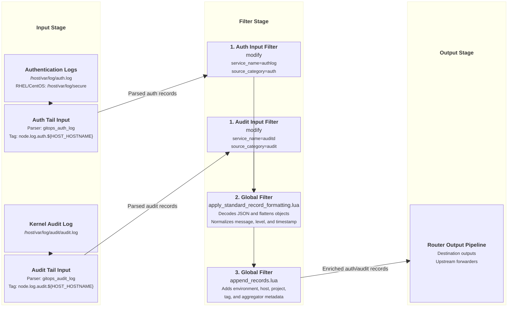

# Host Auth & Audit Log Ingestion Input

This document details host authentication (`auth.log` / `secure`) and kernel audit daemon (`audit.log`) log ingestion supported by `fluent-bit-router`.

---

## Overview

When enabled with `ENABLE_AUTH_LOG_INPUT=true` or `ENABLE_AUDIT_LOG_INPUT=true` and `/host/var/log` is mounted into the container, `fluent-bit-router` scans for SSH authentication logs and Linux kernel audit logs, tailing them with custom regex parsers and tagging them with appropriate metadata categories.

---

## Configuration Reference & Gating Flags

### Environment Variables & File Detection

| Variable / Target Path          | Ingested Category | Description / Action                                                  | Parser Used        |
| ------------------------------- | ----------------- | --------------------------------------------------------------------- | ------------------ |
| `ENABLE_AUTH_LOG_INPUT`         | `auth`            | Enable host SSH/auth log ingestion (`true`/`false`). Default `false`. | `gitops_auth_log`  |
| `ENABLE_AUDIT_LOG_INPUT`        | `audit`           | Enable host auditd log ingestion (`true`/`false`). Default `false`.   | `gitops_audit_log` |
| `/host/var/log/auth.log`        | `auth`            | Debian/Ubuntu SSH auth log path (scanned when auth input enabled).    | `gitops_auth_log`  |
| `/host/var/log/secure`          | `auth`            | RHEL/CentOS auth log path (scanned when auth input enabled).          | `gitops_auth_log`  |
| `/host/var/log/audit/audit.log` | `audit`           | Kernel audit log path (scanned when audit input enabled).             | `gitops_audit_log` |

### Configuration Templates

#### Auth Log Pipeline Template

```yaml
pipeline:
  inputs:
    - name: tail
      tag: node.log.auth.${HOST_HOSTNAME}
      path: /host/var/log/auth.log
      parser: gitops_auth_log
      db: /var/fluent-bit/state/auth-log.db
      db.sync: normal
      refresh_interval: 10
      rotate_wait: 30
      read_from_head: On
      skip_long_lines: On
      mem_buf_limit: 20MB
      storage.type: filesystem

  filters:
    - name: modify
      match: node.log.auth.**
      Add:
        - service_name authlog
        - source_category auth
```

#### Auditd Log Pipeline Template

```yaml
pipeline:
  inputs:
    - name: tail
      tag: node.log.audit.${HOST_HOSTNAME}
      path: /host/var/log/audit/audit.log
      parser: gitops_audit_log
      db: /var/fluent-bit/state/audit-log.db
      db.sync: normal
      refresh_interval: 10
      rotate_wait: 30
      read_from_head: On
      skip_long_lines: On
      mem_buf_limit: 20MB
      storage.type: filesystem

  filters:
    - name: modify
      match: node.log.audit.**
      Add:
        - service_name auditd
        - source_category audit
```

---

## Ingestion & Filtering Flow Diagram



---

## Applied Parsers & Filters

### Custom Parsers (`pipeline.parsers`)

```yaml
pipeline:
  parsers:
    - name: gitops_auth_log
      format: regex
      regex: '^(?<time>[A-Z][a-z]{2}\s+[ 0-9]{1,2}\s\d{2}:\d{2}:\d{2})\s(?<host>[^ ]+)\s(?<process>[^:]+):\s(?<message>.*)$'
      time_key: time
      time_format: "%b %d %H:%M:%S"

    - name: gitops_audit_log
      format: regex
      regex: '^type=(?<audit_type>[^ ]+)\s+msg=audit\((?<time>\d+\.\d+):(?<audit_id>\d+)\):\s(?<message>.*)$'
      time_key: time
      time_format: "%s.%L"
```

### Global Core Filters

- **[`apply_standard_record_formatting.lua`](input-global-filters.md#1-core-record-formatting-filter-apply_standard_record_formattinglua)**: Decodes string JSON, normalizes `message`, flattens nested objects, converts `source.` keys to `source_`, and normalizes level/timestamp.
- **[`append_records.lua`](input-global-filters.md#2-environmental-metadata-enrichment-filter-append_recordslua)**: Appends `source_env`, `source_env_type`, `source_env_region`, `source_hostname`, `source_env_isolation_scope`, `source_routing_tag`, and `source_aggregator`.

---

## Verification & Testing

Trigger an SSH or auth log entry on the host:

```bash
sudo -v
```

Check `fluent-bit-router` container logs to verify `service_name="authlog"` and `source_category="auth"` records are parsed and ingested.
