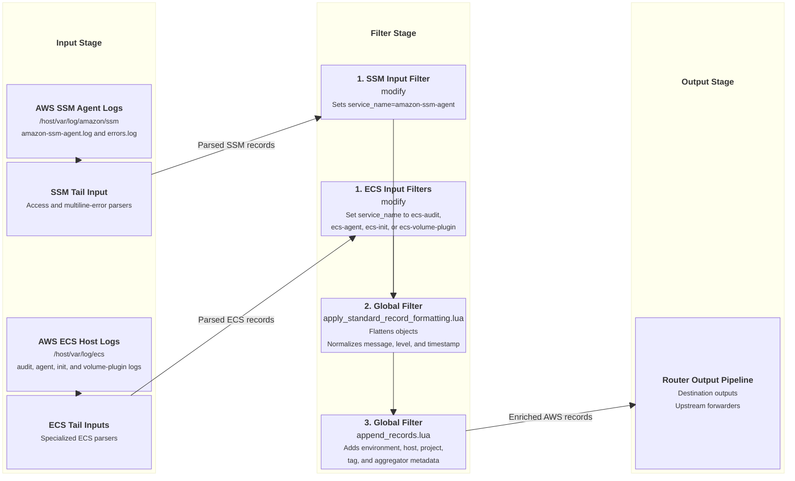

# AWS Cloud Agent Log Ingestion Input

This document details AWS SSM Agent and AWS ECS host log ingestion supported by `fluent-bit-router`.

---

## Overview

When enabled with `ENABLE_AWS_SSM_INPUT=true` or `ENABLE_AWS_ECS_INPUT=true` and deployed on AWS EC2 instances with `/host/var/log` mounted, `fluent-bit-router` detects AWS SSM Agent logs (`amazon-ssm-agent.log`, `errors.log`) and AWS ECS host logs (`audit.log`, `ecs-agent.log`, `ecs-init.log`, `ecs-volume-plugin.log`), tailing them with specialized multiline and logfmt parsers.

---

## Configuration Reference & Gating Flags

### Environment Variables & File Detection

| Variable / Target Directory | Ingested `service_name`                                   | Description / Action                                              | Parsers Used                                                                                                           |
| --------------------------- | --------------------------------------------------------- | ----------------------------------------------------------------- | ---------------------------------------------------------------------------------------------------------------------- |
| `ENABLE_AWS_SSM_INPUT`      | `amazon-ssm-agent`                                        | Enable AWS SSM Agent log input (`true`/`false`). Default `false`. | `amazon-ssm-agent-access`, `amazon-ssm-agent-multiline-error`, `amazon-ssm-agent-error`                                |
| `ENABLE_AWS_ECS_INPUT`      | `ecs-audit`, `ecs-agent`, `ecs-init`, `ecs-volume-plugin` | Enable AWS ECS host log input (`true`/`false`). Default `false`.  | `amazon-ecs-audit`, `amazon-ecs-audit-extract-time`, `amazon-ecs-agent`, `amazon-ecs-init`, `amazon-ecs-volume-plugin` |
| `/host/var/log/amazon/ssm`  | `amazon-ssm-agent`                                        | SSM Agent log path (scanned when `ENABLE_AWS_SSM_INPUT=true`).    | `amazon-ssm-agent-access`, `amazon-ssm-agent-multiline-error`, `amazon-ssm-agent-error`                                |
| `/host/var/log/ecs`         | `ecs-audit`, `ecs-agent`, `ecs-init`, `ecs-volume-plugin` | ECS host log path (scanned when `ENABLE_AWS_ECS_INPUT=true`).     | `amazon-ecs-audit`, `amazon-ecs-audit-extract-time`, `amazon-ecs-agent`, `amazon-ecs-init`, `amazon-ecs-volume-plugin` |

---

## Ingestion & Filtering Flow Diagram



---

## Applied Parsers & Filters

### Custom Parsers (`pipeline.parsers` & `multiline_parsers`)

```yaml
pipeline:
  parsers:
    - name: amazon-ssm-agent-access
      format: regex
      regex: '^(?<time>\d{4}-\d{2}-\d{2} \d{2}:\d{2}:\d{2})(?>\.\d{1,4})?\s+(?<level>\w+)\s*(?>\[(?<component>[^\]]+)\])?\s*(?<message>.*)$'
      time_key: time
      time_format: "%Y-%m-%d %H:%M:%S"

    - name: amazon-ecs-agent
      format: logfmt
      time_key: time
      time_keep: On

  multiline_parsers:
    - name: amazon-ssm-agent-multiline-error
      type: regex
      flush_timeout: 1000
      rules:
        - state: start_state
          regex: '/^(\d{4}-\d{2}-\d{2} \d{2}:\d{2}:\d{2}\.\d{1,4})/'
          next_state: cont
        - state: cont
          regex: '/^(?!\d{4}-\d{2}-\d{2} \d{2}:\d{2}:\d{2}\.\d{1,4}).*/'
          next_state: cont
```

### Global Core Filters

- **[`apply_standard_record_formatting.lua`](input-global-filters.md#1-core-record-formatting-filter-apply_standard_record_formattinglua)**: Decodes string JSON, normalizes `message`, flattens nested objects, converts `source.` keys to `source_`, and normalizes level/timestamp.
- **[`append_records.lua`](input-global-filters.md#2-environmental-metadata-enrichment-filter-append_recordslua)**: Appends `source_env`, `source_env_type`, `source_env_region`, `source_hostname`, `source_env_isolation_scope`, `source_routing_tag`, and `source_aggregator`. AWS SSM Agent and ECS host records are host-level logs and use `source=host`.
