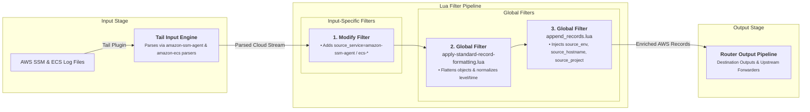

# AWS Cloud Agent Log Ingestion Input

This document details AWS SSM Agent and AWS ECS host log ingestion supported by `fluent-bit-router`.

---

## Overview

When deployed on AWS EC2 instances with `/host/var/log` mounted, `fluent-bit-router` automatically detects AWS SSM Agent logs (`amazon-ssm-agent.log`, `errors.log`) and AWS ECS host logs (`audit.log`, `ecs-agent.log`, `ecs-init.log`, `ecs-volume-plugin.log`), tailing them with specialized multiline and logfmt parsers.

---

## Configuration Reference & Auto-Detection

### File Detection Triggers

| Target Directory           | Log Files Tailed                                                      | Ingested `source_service`                                 | Parsers Used                                                                          |
| -------------------------- | --------------------------------------------------------------------- | --------------------------------------------------------- | ------------------------------------------------------------------------------------- |
| `/host/var/log/amazon/ssm` | `amazon-ssm-agent.log`, `errors.log`                                  | `amazon-ssm-agent`                                        | `amazon-ssm-agent-access`, `amazon-ssm-agent-multiline-error`                         |
| `/host/var/log/ecs`        | `audit.log`, `ecs-agent.log`, `ecs-init.log`, `ecs-volume-plugin.log` | `ecs-audit`, `ecs-agent`, `ecs-init`, `ecs-volume-plugin` | `amazon-ecs-audit`, `amazon-ecs-agent`, `amazon-ecs-init`, `amazon-ecs-volume-plugin` |

---

## Ingestion & Filtering Flow Diagram



---

## Applied Parsers & Filters

### Custom Parsers (`pipeline.parsers` & `multiline_parsers`)

```yaml
pipeline:
  parsers:
    - name: amazon-ssm-agent-access
      format: regex
      regex: '^(?<time>\d{4}-\d{2}-\d{2} \d{2}:\d{2}:\d{2})(?>\.\d{1,4})?\s+(?<level>\w+)\s*(?>\[(?<component>[^\]]+)\])?\s*(?<message>.*)$'
      time_key: time
      time_format: '%Y-%m-%d %H:%M:%S'

    - name: amazon-ecs-agent
      format: logfmt
      time_key: time
      time_keep: On

  multiline_parsers:
    - name: amazon-ssm-agent-multiline-error
      type: regex
      flush_timeout: 1000
      rules:
        - state: start_state
          regex: '/^(\d{4}-\d{2}-\d{2} \d{2}:\d{2}:\d{2}\.\d{1,4})/'
          next_state: cont
        - state: cont
          regex: '/^(?!\d{4}-\d{2}-\d{2} \d{2}:\d{2}:\d{2}\.\d{1,4}).*/'
          next_state: cont
```

### Global Core Filters

- **[`apply-standard-record-formatting.lua`](input-global-filters.md#1-core-record-formatting-filter-apply-standard-record-formattinglua)**: Decodes string JSON, normalizes `message`, flattens nested objects, converts `source.` keys to `source_`, and normalizes level/timestamp.
- **[`append_records.lua`](input-global-filters.md#2-environmental-metadata-enrichment-filter-append_recordslua)**: Appends `source_env`, `source_hostname`, `source_project`, `source_tag`, and `source_aggregator`.
