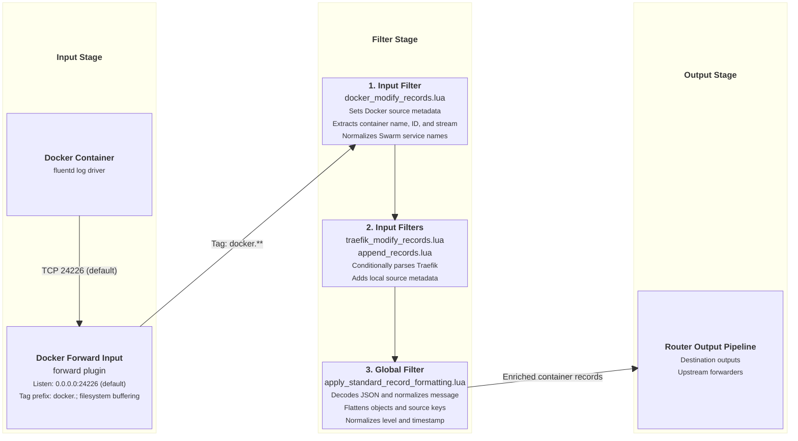

# Docker Container Forward Input

This document details the dedicated Docker container log ingestion input supported by `fluent-bit-router`.

---

## Overview

The Docker Forward input listens on a dedicated TCP port (default `24226`) to receive logs streamed directly from Docker containers running the `fluentd` log driver. It isolates container logs from general forward traffic using a dedicated tag prefix and enriches records using `docker_modify_records.lua`.

---

## Configuration Reference

### Environment Variables

| Variable                      | Description                                               | Default |
| ----------------------------- | --------------------------------------------------------- | ------- |
| `ENABLE_DOCKER_FORWARD_INPUT` | Enable dedicated Docker Forward input (`true` / `false`). | `false` |
| `DOCKER_FORWARD_INPUT_PORT`   | Listen port for Docker `fluentd` driver.                  | `24226` |

### Configuration Template

When `ENABLE_DOCKER_FORWARD_INPUT=true`, `entrypoint.sh` generates the following YAML block in `fluent-bit.docker-forward.input.yaml`:

```yaml
pipeline:
  inputs:
    - name: forward
      listen: 0.0.0.0
      port: ${DOCKER_FORWARD_INPUT_PORT}
      tag_prefix: <derived Docker tag prefix>
      storage.type: filesystem
      buffer_chunk_size: 5M
      buffer_max_size: 1000M

  filters:
    - name: lua
      match: "<derived Docker tag prefix>**"
      script: docker_modify_records.lua
      call: docker_modify_records
      time_as_table: true
```

The global filter configuration is loaded after this input-specific configuration. The effective order is `docker_modify_records.lua` → `traefik_modify_records.lua` (a no-op unless `service_name=traefik`) → `append_records.lua` → `apply_standard_record_formatting.lua`.

---

## Ingestion & Filtering Flow Diagram



---

## Applied Filters

### 1. Input-Specific Filter (`docker_modify_records.lua`)

Runs strictly on records received through the dedicated Docker Forward input:

- **Stream Separation**: Moves container stream (`stdout` / `stderr`) to `source_stream`, setting top-level `source = "docker"`.
- **Category Tagging**: Sets `source_category = "docker"`.
- **Timestamp Preservation**: Copies Docker's exact `time` value to `timestamp` when no application timestamp already exists. The global formatter performs the UTC and nanosecond-precision conversion.
- **Container Identifiers**: Extracts `source_container_name` (stripping leading `/`) and `source_container_id`.
- **Swarm Task Normalization**: Parses Docker Swarm task names (`stack_service.slot.taskid` for replicated tasks or `stack_service.nodeid.taskid` for global tasks) into `service_name = stack_service` to avoid Loki label cardinality spikes.
- **Workload Metadata**: Copies source-provided `service_project`, `service_name`, and `service_version` attributes from Docker logging-driver metadata. Source-provided `source_*` attributes are also preserved and override router defaults when present; the configured `ENVIRONMENT_ISOLATION_SCOPE` remains authoritative when set.

### 2. Global Core Filters

- **[`apply_standard_record_formatting.lua`](input-global-filters.md#1-core-record-formatting-filter-apply_standard_record_formattinglua)**: Decodes string JSON, normalizes `message`, flattens nested objects, converts `source.` keys to `source_`, and normalizes level/timestamp.
- **[`append_records.lua`](input-global-filters.md#2-environmental-metadata-enrichment-filter-append_recordslua)**: Appends `source_env`, `source_env_type`, `source_env_region`, `source_hostname`, `source_env_isolation_scope`, `source_routing_tag`, and `source_aggregator`.

---

## Verification & Testing

Launch a test container pointing its log-driver to `127.0.0.1:24226`:

```bash
docker run --rm \
  --log-driver=fluentd \
  --log-opt fluentd-address=127.0.0.1:24226 \
  --log-opt tag="test-container" \
  alpine echo "Hello Docker Forward Input"
```

Check `fluent-bit-router` container logs (`docker logs -f fluent-bit-router`) to verify `source_category="docker"`, `source_container_name="test-container"`, and `service_name="test-container"` are populated.
