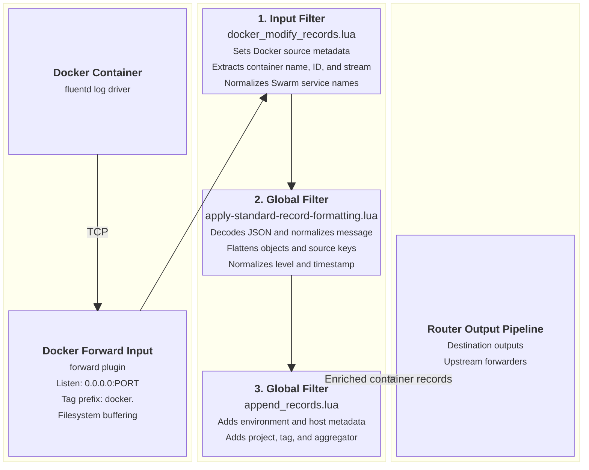

# Docker Container Forward Input

This document details the dedicated Docker container log ingestion input supported by `fluent-bit-router`.

---

## Overview

The Docker Forward input listens on a dedicated TCP port (default `24226`) to receive logs streamed directly from Docker containers running the `fluentd` log driver. It isolates container logs from general forward traffic using a dedicated tag prefix and enriches records using `docker_modify_records.lua`.

---

## Configuration Reference

### Environment Variables

| Variable                      | Description                                               | Default   |
| ----------------------------- | --------------------------------------------------------- | --------- |
| `ENABLE_DOCKER_FORWARD_INPUT` | Enable dedicated Docker Forward input (`true` / `false`). | `false`   |
| `DOCKER_FORWARD_INPUT_PORT`   | Listen port for Docker `fluentd` driver.                  | `24226`   |
| `DOCKER_TAG_PREFIX`           | Tag prefix applied to incoming container logs.            | `docker.` |

### Configuration Template

When `ENABLE_DOCKER_FORWARD_INPUT=true`, `entrypoint.sh` generates the following YAML block in `fluent-bit.docker-forward.input.yaml`:

```yaml
pipeline:
  inputs:
    - name: forward
      listen: 0.0.0.0
      port: ${DOCKER_FORWARD_INPUT_PORT}
      tag_prefix: ${DOCKER_TAG_PREFIX}
      storage.type: filesystem
      buffer_chunk_size: 5M
      buffer_max_size: 1000M

  filters:
    - name: lua
      match: "${DOCKER_TAG_PREFIX}**"
      script: docker_modify_records.lua
      call: docker_modify_records
```

---

## Ingestion & Filtering Flow Diagram



---

## Applied Filters

### 1. Input-Specific Filter (`docker_modify_records.lua`)

Runs strictly on records matching `${DOCKER_TAG_PREFIX}**`:

- **Stream Separation**: Moves container stream (`stdout` / `stderr`) to `source_stream`, setting top-level `source = "docker"`.
- **Category Tagging**: Sets `source_category = "docker"`.
- **Container Identifiers**: Extracts `source_container_name` (stripping leading `/`) and `source_container_id`.
- **Swarm Task Normalization**: Parses Docker Swarm task names (`stack_service.slot.taskid` for replicated tasks or `stack_service.nodeid.taskid` for global tasks) into `source_service = stack_service` to avoid Loki label cardinality spikes.

### 2. Global Core Filters

- **[`apply-standard-record-formatting.lua`](input-global-filters.md#1-core-record-formatting-filter-apply-standard-record-formattinglua)**: Decodes string JSON, normalizes `message`, flattens nested objects, converts `source.` keys to `source_`, and normalizes level/timestamp.
- **[`append_records.lua`](input-global-filters.md#2-environmental-metadata-enrichment-filter-append_recordslua)**: Appends `source_env`, `source_hostname`, `source_project`, `source_tag`, and `source_aggregator`.

---

## Verification & Testing

Launch a test container pointing its log-driver to `127.0.0.1:24226`:

```bash
docker run --rm \
  --log-driver=fluentd \
  --log-opt fluentd-address=127.0.0.1:24226 \
  --log-opt tag="test-container" \
  alpine echo "Hello Docker Forward Input"
```

Check `fluent-bit-router` container logs (`docker logs -f fluent-bit-router`) to verify `source_category="docker"`, `source_container_name="test-container"`, and `source_service="test-container"` are populated.
