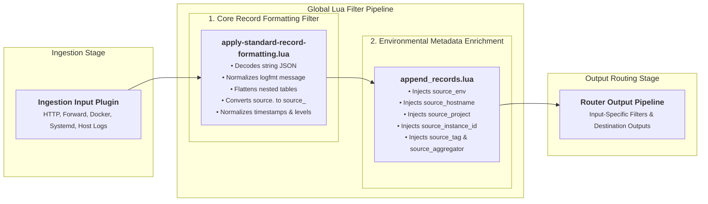

# Global Core Filters Architecture

This document details the global Lua filter pipeline applied to all ingested logs in `fluent-bit-router`.

---

## Global Filter Pipeline Overview

Every log record ingested by `fluent-bit-router` (regardless of input source) passes through two global Lua filters registered in [`fluent-bit.yaml`](../docker/overlay/etc/fluent-bit/fluent-bit.yaml):

---

## 1. Core Record Formatting Filter (`apply-standard-record-formatting.lua`)

This Lua filter ([`apply-standard-record-formatting.lua`](../docker/overlay/etc/fluent-bit/apply-standard-record-formatting.lua)) normalizes, flattens, and cleans up raw record structures.

### Execution Flow Diagram

```mermaid
flowchart LR
    %% ROW 1: DECODING & NORMALIZATION
    subgraph Stage1 [Parsing & Normalization]
        A["<b>Raw Record Input</b>"] --> B["<b>1. Decode String JSON</b><br><small>Parses embedded JSON strings</small>"]
        B --> C["<b>2. Normalize Message</b><br><small>Builds logfmt for table messages</small>"]
    end

    %% Drop down connection to Stage 2
    C --> D

    %% ROW 2: FLATTENING & KEY MUTATION
    subgraph Stage2 [Structure & Key Cleanup]
        D["<b>3. Flatten Nested Tables</b><br><small>Converts objects to dotted keys</small>"] --> E["<b>4. Convert source. to source_</b><br><small>Renames keys to underscores</small>"]
        E --> F["<b>5. Remove Empty short_message</b><br><small>Cleans up payload size</small>"]
    end

    %% Drop down connection to Stage 3
    F --> G

    %% ROW 3: DEFAULTS & LEVEL NORMALIZATION
    subgraph Stage3 [Defaults & Severity Mapping]
        G["<b>6 & 7. Fallback Fields</b><br><small>Sets default source & service_name</small>"] --> H["<b>8. Normalize Timestamp</b><br><small>Pads Unix nanoseconds (.000000000)</small>"]
        H --> I["<b>9. Normalize Severity Level</b><br><small>Maps level code (3) & levelname (error)</small>"]
    end

    %% Drop down connection to output
    I --> J

    %% ROW 4: OUTPUT
    subgraph Stage4 [Output Stage]
        J["<b>Formatted Record Output</b>"]
    end

    %% Structural layout constraints
    Stage1 ~~~ Stage2
    Stage2 ~~~ Stage3
    Stage3 ~~~ Stage4
```

---

## 2. Environmental Metadata Enrichment Filter (`append_records.lua`)

This Lua filter ([`append_records.lua`](../docker/overlay/etc/fluent-bit/append_records.lua)) dynamically reads process environment variables at runtime via Lua's native `os.getenv()` function and injects node and environment metadata fields into log records.

### Injected Metadata Fields

| Field Name           | Source Variable          | Description                          | Example                    |
| -------------------- | ------------------------ | ------------------------------------ | -------------------------- |
| `source_tag`         | Tag                      | Full incoming Fluent-Bit tag string. | `flb.homelab.docker.nginx` |
| `source_aggregator`  | Static                   | Always set to `"fluent-bit"`.        | `fluent-bit`               |
| `source_env`         | `${ENVIRONMENT_NAME}`    | Deployment environment name.         | `production`, `homelab`    |
| `source_region`      | `${ENVIRONMENT_REGION}`  | Region identifier.                   | `us-east-1`, `local`       |
| `source_instance_id` | `${INSTANCE_ID}`         | Host instance ID or VM ID.           | `i-0123456789`             |
| `source_hostname`    | `${HOST_HOSTNAME}`       | Host server hostname.                | `homelab-node-01`          |
| `source_project`     | `${ENVIRONMENT_PROJECT}` | Project identifier.                  | `streamingtech`            |
| `source`             | Fallback                 | Defaults to `"node"` if unassigned.  | `node`                     |
