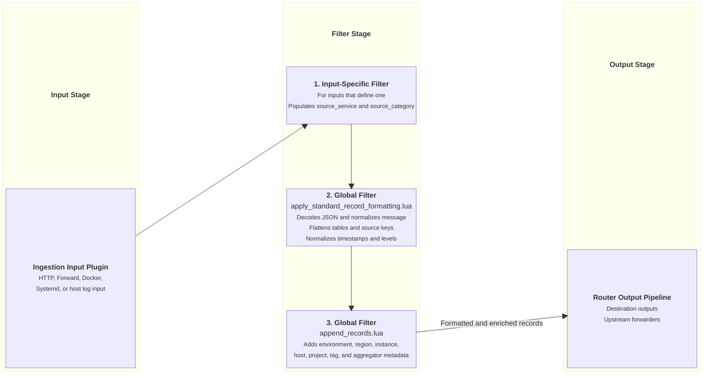
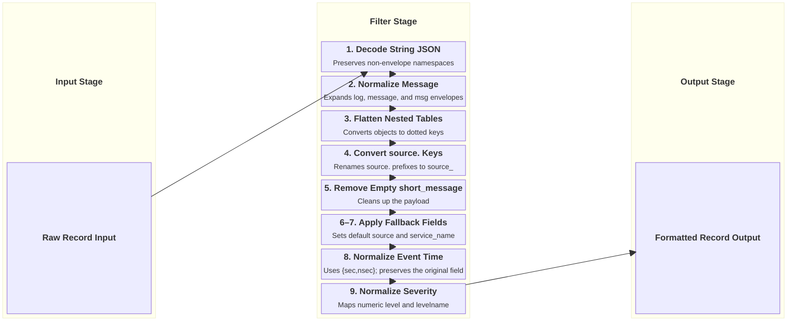

# Global Core Filters Architecture

This document details the global Lua filter pipeline applied to all ingested logs in `fluent-bit-router`.

---

## Global Filter Pipeline Overview

Every log record ingested by `fluent-bit-router` passes through two global Lua filters registered in [`fluent-bit.global-filters.yaml`](../docker/overlay/etc/fluent-bit/fluent-bit.global-filters.yaml). These filters are executed **after** all input-specific filters (such as `docker_modify_records.lua` or `systemd_modify_records.lua`) have populated `source_service` and `source_category`:

---

## 1. Core Record Formatting Filter (`apply_standard_record_formatting.lua`)

This Lua filter ([`apply_standard_record_formatting.lua`](../docker/overlay/etc/fluent-bit/apply_standard_record_formatting.lua)) normalizes, flattens, and cleans up raw record structures.

Only the `message`, `log`, and `msg` envelope fields are expanded into the record root. Their precedence is `message`, then `log`, then `msg`; conflicting values are preserved as `_extracted`, `_extracted2`, and subsequent fields. JSON decoded from any other field remains under that field's dotted namespace.

Valid application timestamps remain unchanged in the record and are parsed into Fluent Bit's `{sec, nsec}` event-time representation. Numeric timestamps may use Unix seconds, milliseconds, microseconds, or nanoseconds; 19-digit nanosecond values should be strings to avoid Lua floating-point precision loss. When the application timestamp is absent or invalid, the existing Fluent Bit event timestamp is retained and added to the record.

### Execution Flow Diagram

---

## 2. Environmental Metadata Enrichment Filter (`append_records.lua`)

This Lua filter ([`append_records.lua`](../docker/overlay/etc/fluent-bit/append_records.lua)) dynamically reads process environment variables at runtime via Lua's native `os.getenv()` function and injects node and environment metadata fields into log records.

### Injected Metadata Fields

| Field Name           | Source Variable          | Description                          | Example                    |
| -------------------- | ------------------------ | ------------------------------------ | -------------------------- |
| `source_tag`         | Tag                      | Full incoming Fluent-Bit tag string. | `flb.homelab.docker.nginx` |
| `source_aggregator`  | Static                   | Always set to `"fluent-bit"`.        | `fluent-bit`               |
| `source_env`         | `${ENVIRONMENT_NAME}`    | Deployment environment name.         | `production`, `homelab`    |
| `source_region`      | `${ENVIRONMENT_REGION}`  | Region identifier.                   | `us-east-1`, `local`       |
| `source_instance_id` | `${INSTANCE_ID}`         | Host instance ID or VM ID.           | `i-0123456789`             |
| `source_hostname`    | `${HOST_HOSTNAME}`       | Host server hostname.                | `homelab-node-01`          |
| `source_project`     | `${ENVIRONMENT_PROJECT}` | Project identifier.                  | `streamingtech`            |
| `source`             | Fallback                 | Defaults to `"node"` if unassigned.  | `node`                     |
