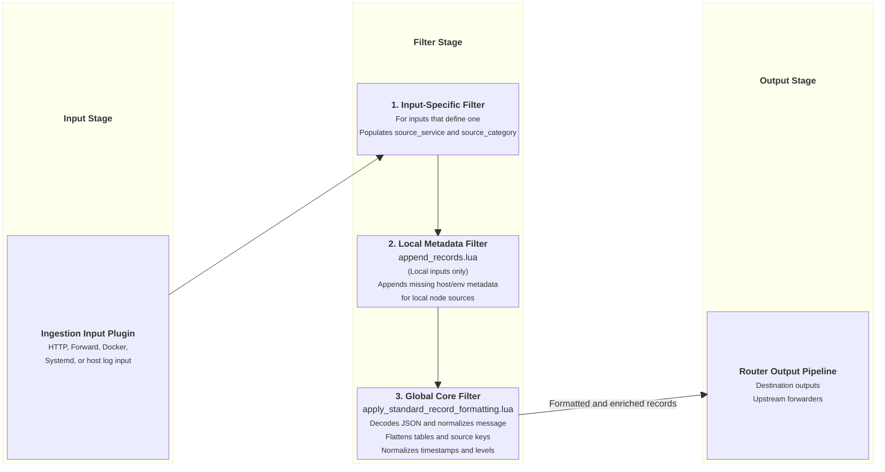
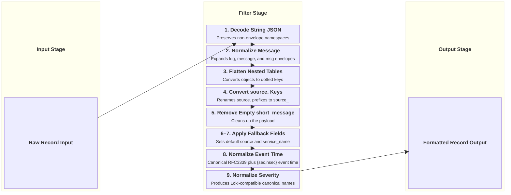

# Global Core Filters Architecture

This document details the global Lua filter pipeline applied to all ingested logs in `fluent-bit-router`.

---

## Global Filter Pipeline Overview

All log records ingested by `fluent-bit-router` pass through the global Lua formatting filter registered in [`fluent-bit.global-filters.yaml`](../docker/overlay/etc/fluent-bit/fluent-bit.global-filters.yaml).

For local log sources (Docker containers, systemd journald, auth, audit, AWS SSM/ECS), host and environmental metadata enrichment is performed by [`append_records.lua`](../docker/overlay/etc/fluent-bit/append_records.lua) calling `append_missing_local_source_metadata`. Network forward inputs (TLS Forward, PT Forward, HTTP Input) bypass `append_records.lua` to ensure remote source metadata is never overwritten with the router's local host identity.

---

## 1. Core Record Formatting Filter (`apply_standard_record_formatting.lua`)

This Lua filter ([`apply_standard_record_formatting.lua`](../docker/overlay/etc/fluent-bit/apply_standard_record_formatting.lua)) normalizes, flattens, and cleans up raw record structures.

Only the `message`, `log`, and `msg` envelope fields are expanded into the record root. Their precedence is `message`, then `log`, then `msg`; conflicting values are preserved as `_extracted`, `_extracted2`, and subsequent fields. Nested JSON envelopes are decoded recursively to a maximum of five layers. JSON primitives become ordinary message text, while JSON decoded from any other field remains under that field's dotted namespace.

The `timestamp` field is always a canonical UTC RFC3339 string with nine fractional digits. A supplied application value is retained in `source_timestamp`; invalid values are also retained in `timestamp_invalid`. The `timestamp_source` field is either `application` or `fluent-bit`. Internally, event time uses Fluent Bit's `{sec, nsec}` representation. Numeric timestamps may use Unix seconds, milliseconds, microseconds, or nanoseconds; 19-digit nanosecond values should be strings to avoid Lua floating-point precision loss.

Resource limits bound recursive envelope decoding, table nesting, flattened fields, array elements, decoded JSON size, collision suffixes, and generated logfmt size. When a limit is reached, `formatting_error` identifies the applied limit. Ordinary flattening does not sort maps; only generated logfmt messages sort keys for deterministic output.

The image builds a pinned, checksum-verified [OpenResty Lua CJSON](https://github.com/openresty/lua-cjson) module and enables decoded-array metatables. The formatter recognizes both `cjson.array_mt` and Fluent Bit's native MessagePack array marker. Empty containers therefore retain their identity while flattening: an empty object becomes the scalar string `{}`, and an empty array becomes `[]`. Non-empty arrays retain their numeric dotted keys.

Fluent Bit preserves its native array marker when a Lua filter mutates an incoming record in place. It does not recognize `cjson.array_mt` when a filter returns a newly decoded CJSON table, however. A filter which decodes JSON must therefore flatten that table in the same callback, retain the original JSON string, or re-encode nested values before returning them for the standard formatter. The Traefik filter re-encodes nested values while promoting scalar access-log fields directly.

### Execution Flow Diagram

---

## 2. Local Source Metadata Enrichment Filter (`append_records.lua`)

This Lua filter ([`append_records.lua`](../docker/overlay/etc/fluent-bit/append_records.lua)) exports `append_missing_local_source_metadata`. It dynamically reads process environment variables at runtime via Lua's native `os.getenv()` function and injects host and environment metadata fields into log records originating on the local host. Host-level inputs use `source=host`; Docker records set `source=docker` and preserve `stdout` or `stderr` as `source_stream`. Network forward inputs bypass this filter to preserve remote source metadata.

### Injected Metadata Fields

| Field Name               | Source Variable          | Description                                                     | Example                    |
| ------------------------ | ------------------------ | --------------------------------------------------------------- | -------------------------- |
| `source_routing_tag`     | Tag                      | Full incoming routing tag string.                               | `flb.homelab.docker.nginx` |
| `source_aggregator`      | Static                   | Always set to `"fluent-bit"`.                                   | `fluent-bit`               |
| `source_env`             | `${ENVIRONMENT_NAME}`    | Logical environment name.                                       | `platform-primary`         |
| `source_type`            | `${ENVIRONMENT_TYPE}`    | Lifecycle or deployment class.                                  | `staging`, `production`    |
| `source_region`          | `${ENVIRONMENT_REGION}`  | Cloud or physical region.                                       | `us-east-1`, `nz`          |
| `source_instance_id`     | `${INSTANCE_ID}`         | Host instance ID or VM ID.                                      | `i-0123456789`             |
| `source_hostname`        | `${HOST_HOSTNAME}`       | Host server hostname.                                           | `homelab-node-01`          |
| `source_isolation_scope` | `${ENVIRONMENT_PROJECT}` | Security and credential-sharing boundary across infrastructure. | `staging-2026-03-08`       |
| `source`                 | Local source marker      | `host` for host-level inputs; Docker inputs set `docker`.       | `host`                     |
