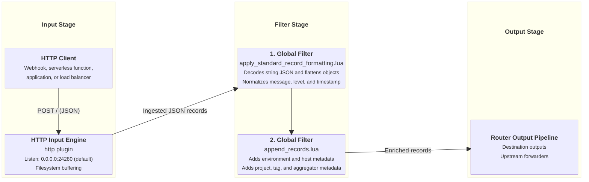

# HTTP Ingestion Input

This document details the HTTP log ingestion input supported by `fluent-bit-router`.

---

## Overview

The HTTP input plugin allows `fluent-bit-router` to receive log batches sent as HTTP `POST` JSON requests. It is useful for receiving logs from webhooks, serverless functions, application endpoints, or load balancers.

> [!NOTE]
> `ENABLE_HTTP_INPUT` listens for unencrypted HTTP payloads directly on port `24280`. It does not handle TLS termination internally. If secure HTTPS ingestion over external or untrusted networks is required, place an ingress reverse proxy (such as Traefik or Nginx) in front of `fluent-bit-router` to handle TLS termination and certificate management.

---

## Configuration Reference

### Environment Variables

| Variable                 | Description                                                     | Default |
| ------------------------ | --------------------------------------------------------------- | ------- |
| `ENABLE_HTTP_INPUT`      | Enable HTTP input plugin (`true` / `false`).                    | `false` |
| `HTTP_INPUT_PORT`        | Listen port for HTTP requests.                                  | `24280` |
| `ENABLE_THREADED_INPUTS` | Enable multi-threading for input processing (`true` / `false`). | `false` |

### Configuration Template

When `ENABLE_HTTP_INPUT=true`, `entrypoint.sh` generates the following YAML block in `fluent-bit.http.input.yaml`:

```yaml
pipeline:
  inputs:
    - name: http
      listen: 0.0.0.0
      port: ${HTTP_INPUT_PORT}
      mem_buf_limit: 64M
      storage.type: filesystem
      storage.pause_on_chunks_overlimit: on
      buffer_chunk_size: 5M
      buffer_max_size: 1000M
      threaded: ${ENABLE_THREADED_INPUTS}
```

---

## TLS Termination & Reverse Proxy Integration

Since `fluent-bit-router` accepts plain HTTP payloads on port `24280`, external HTTPS requests should be proxied through an ingress reverse proxy.

### 1. Traefik Docker Swarm Configuration (Let's Encrypt)

When deploying in Docker Swarm with Traefik as your ingress proxy, attach Traefik routing labels to the `fluent-bit-router` service. Traefik will automatically issue and renew Let's Encrypt TLS certificates and forward HTTPS traffic to `fluent-bit-router` on port `24280`:

```yaml
version: "3.8"

services:
  fluent-bit-router:
    image: streamingtech/fluent-bit-router:latest
    environment:
      - ENABLE_HTTP_INPUT=true
      - HTTP_INPUT_PORT=24280
    deploy:
      labels:
        - "traefik.enable=true"
        # HTTP-to-HTTPS redirect
        - "traefik.http.routers.fluent-bit-http.rule=Host(`logs.example.com`)"
        - "traefik.http.routers.fluent-bit-http.entrypoints=web"
        - "traefik.http.routers.fluent-bit-http.middlewares=redirect-to-https"
        - "traefik.http.middlewares.redirect-to-https.redirectscheme.scheme=https"
        # HTTPS Router with Let's Encrypt TLS
        - "traefik.http.routers.fluent-bit-https.rule=Host(`logs.example.com`)"
        - "traefik.http.routers.fluent-bit-https.entrypoints=websecure"
        - "traefik.http.routers.fluent-bit-https.tls=true"
        - "traefik.http.routers.fluent-bit-https.tls.certresolver=letsencrypt"
        # Target internal container port
        - "traefik.http.services.fluent-bit-service.loadbalancer.server.port=24280"
```

### 2. Nginx Reverse Proxy Configuration

If using Nginx as an ingress proxy in front of `fluent-bit-router`:

```nginx
server {
    listen 443 ssl http2;
    server_name logs.example.com;

    ssl_certificate /etc/letsencrypt/live/logs.example.com/fullchain.pem;
    ssl_certificate_key /etc/letsencrypt/live/logs.example.com/privkey.pem;

    location / {
        proxy_pass http://fluent-bit-router:24280/;
        proxy_set_header Host $host;
        proxy_set_header X-Real-IP $remote_addr;
        proxy_set_header X-Forwarded-For $proxy_add_x_forwarded_for;
        proxy_set_header X-Forwarded-Proto $scheme;
    }
}
```

---

## Ingestion & Filtering Flow Diagram



---

## Applied Filters

### 1. Global Core Filters

Logs received via HTTP pass through all global core filters:

- **[`apply_standard_record_formatting.lua`](input-global-filters.md#1-core-record-formatting-filter-apply_standard_record_formattinglua)**: Decodes string JSON, normalizes `message`, flattens nested objects, converts `source.` keys to `source_`, and normalizes level/timestamp.
- **[`append_records.lua`](input-global-filters.md#2-environmental-metadata-enrichment-filter-append_recordslua)**: Appends `source_env`, `source_env_type`, `source_env_region`, `source_hostname`, `source_env_isolation_scope`, `source_routing_tag`, and `source_aggregator`.

---

## Verification & Testing

Send a test JSON payload to the HTTP endpoint using `curl`:

```bash
curl -X POST http://127.0.0.1:24280/ \
  -H "Content-Type: application/json" \
  -d '[{"log": "Test HTTP log message", "service": "my-app", "level": "info"}]'
```

Verify in `fluent-bit-router` container logs (`docker logs -f fluent-bit-router`) that the log is received, formatted, and enriched.
