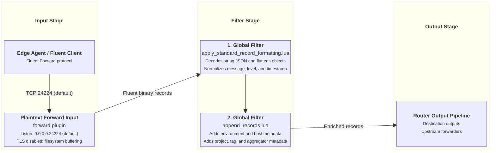

# Plaintext Forward Ingestion Input

This document details the Plaintext Forward ingestion input supported by `fluent-bit-router`.

---

## Overview

The Plaintext Forward input plugin listens for unencrypted Fluent binary Forward connections from upstream agents, edge routers, or applications.

---

## Configuration Reference

### Environment Variables

| Variable                  | Description                                               | Default       |
| ------------------------- | --------------------------------------------------------- | ------------- |
| `ENABLE_PT_FORWARD_INPUT` | Enable Plaintext Forward input plugin (`true` / `false`). | `false`       |
| `PT_FORWARD_INPUT_PORT`   | Listen port for Plaintext Forward connections.            | `24224`       |
| `HOST_HOSTNAME`           | Hostname reported during Forward handshakes.              | `$(hostname)` |

### Configuration Template

When `ENABLE_PT_FORWARD_INPUT=true`, `entrypoint.sh` generates the following YAML block in `fluent-bit.pt-forward.input.yaml`:

```yaml
pipeline:
  inputs:
    - name: forward
      listen: 0.0.0.0
      port: ${PT_FORWARD_INPUT_PORT}
      self_hostname: ${HOST_HOSTNAME}
      mem_buf_limit: 64M
      storage.type: filesystem
      storage.pause_on_chunks_overlimit: on
      buffer_chunk_size: 5M
      buffer_max_size: 1000M
      tls: off
      tls.verify: off
      threaded: ${ENABLE_THREADED_INPUTS:-false}
```

---

## Ingestion & Filtering Flow Diagram



---

## Applied Filters

### 1. Global Core Filters

Logs received via Plaintext Forward pass through all global core filters:

- **[`apply_standard_record_formatting.lua`](input-global-filters.md#1-core-record-formatting-filter-apply_standard_record_formattinglua)**: Decodes string JSON, normalizes `message`, flattens nested objects, converts `source.` keys to `source_`, and normalizes level/timestamp.
- **[`append_records.lua`](input-global-filters.md#2-environmental-metadata-enrichment-filter-append_recordslua)**: Appends `source_env`, `source_hostname`, `source_project`, `source_tag`, and `source_aggregator`.

---

## Verification & Testing

Send a test log payload using the `./tests/send-single-log.sh` test script:

```bash
./tests/send-single-log.sh 127.0.0.1 24224
```

Verify in `fluent-bit-router` container logs (`docker logs -f fluent-bit-router`) that the test message is received and processed.
