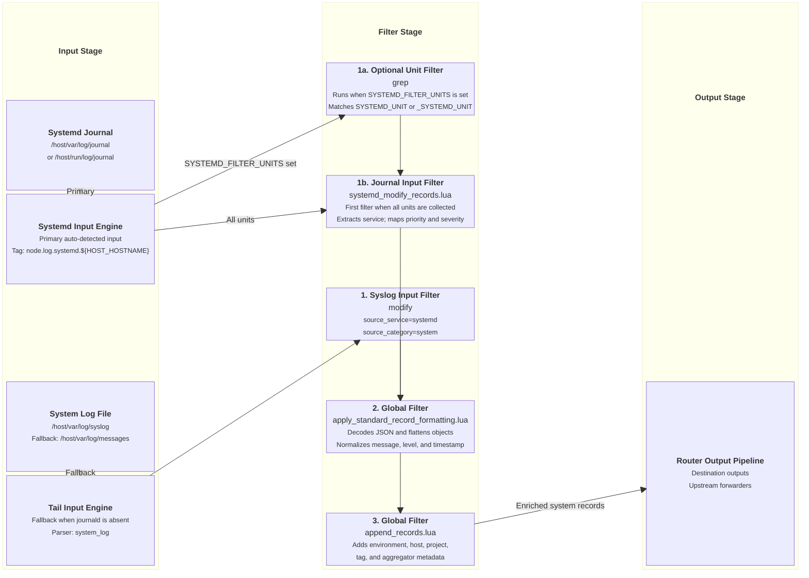

# Systemd Journal & System Log Ingestion Input

This document details systemd journald and syslog fallback log ingestion supported by `fluent-bit-router`.

---

## Overview

When enabled with `ENABLE_SYSTEMD_INPUT=true` and running as an edge node agent with host log directories mounted (`-v /var/log:/host/var/log:ro`), `fluent-bit-router` detects and ingests host systemd journal entries (or falls back to tailing `/host/var/log/syslog` or `/host/var/log/messages`).

---

## Configuration Reference

### Environment Variables & Path Detection

| Variable / Condition     | Description                                                                                                                              | Default / Action                 |
| ------------------------ | ---------------------------------------------------------------------------------------------------------------------------------------- | -------------------------------- |
| `ENABLE_SYSTEMD_INPUT`   | Enable systemd journal & system log fallback input (`true` / `false`). Must be set to `true` to enable.                                  | `false`                          |
| `SYSTEMD_FILTER_UNITS`   | Optional comma-separated regexes matched against `SYSTEMD_UNIT`. Syslog process names are normalized to service-shaped unit names first. | _(empty)_                        |
| `/host/var/log/journal`  | Host systemd journal path.                                                                                                               | Auto-detected when input enabled |
| `/host/run/log/journal`  | Host runtime journal path.                                                                                                               | Auto-detected when input enabled |
| `/host/var/log/syslog`   | Fallback system log file.                                                                                                                | Auto-detected if journald absent |
| `/host/var/log/messages` | Fallback system log file (RHEL/CentOS).                                                                                                  | Auto-detected if journald absent |

> [!NOTE]
> **Systemd Unit Ingestion & Filtering Decision**:
> In `fluent-bit-router`, host systemd journal and system log ingestion filtering is controlled explicitly by `SYSTEMD_FILTER_UNITS`.
>
> - If `SYSTEMD_FILTER_UNITS` is set, a `grep` filter limits ingestion against `SYSTEMD_UNIT`. For syslog fallback records, `system_log_add_unit` strips a trailing PID such as `[1234]` from the parsed process and appends `.service`, so `sshd[1234]` is filtered as `sshd.service`.
> - If `SYSTEMD_FILTER_UNITS` is empty or unset, all host systemd journal logs and fallback system logs are ingested in full without filtering.

### Configuration Templates

#### Primary Systemd Journal Pipeline Template (All Units)

```yaml
pipeline:
  inputs:
    - name: systemd
      tag: node.log.systemd.${HOST_HOSTNAME}
      path: /host/var/log/journal
      db: /var/fluent-bit/state/systemd-journal.db
      db.sync: normal
      read_from_tail: On
      strip_underscores: On

  filters:
    - name: lua
      match: node.log.systemd.**
      script: systemd_modify_records.lua
      call: systemd_modify_records
```

#### Primary Systemd Journal Pipeline Template (Filtered Units via `SYSTEMD_FILTER_UNITS`)

```yaml
pipeline:
  inputs:
    - name: systemd
      tag: flb.privatecloud.node.log.systemd.${HOST_HOSTNAME}
      path: /host/var/log/journal
      db: /var/fluent-bit/state/systemd-journal.db
      db.sync: normal
      read_from_tail: On
      strip_underscores: On

  filters:
    - name: grep
      match: "flb.privatecloud.node.log.systemd.**"
      logical_op: or
      regex:
        - SYSTEMD_UNIT ^gitops-.*$
        - _SYSTEMD_UNIT ^gitops-.*$
        - SYSTEMD_UNIT ^sshd\.service$
        - _SYSTEMD_UNIT ^sshd\.service$
    - name: lua
      match: "flb.privatecloud.node.log.systemd.**"
      script: systemd_modify_records.lua
      call: systemd_modify_records
```

#### Fallback Syslog Pipeline Template

```yaml
pipeline:
  parsers:
    - name: system_log
      format: regex
      regex: '^(?<time>[A-Z][a-z]{2}\s+[ 0-9]{1,2}\s\d{2}:\d{2}:\d{2})\s(?<host>[^ ]+)\s(?<process>[^:]+):\s(?<message>.*)$'
      time_key: time
      time_format: "%b %d %H:%M:%S"

  inputs:
    - name: tail
      tag: node.log.system.${HOST_HOSTNAME}
      path: /host/var/log/syslog
      parser: system_log
      db: /var/fluent-bit/state/system-log.db
      refresh_interval: 10
      rotate_wait: 30
      read_from_head: On
      skip_long_lines: On
      mem_buf_limit: 20MB
      storage.type: filesystem

  filters:
    - name: lua
      match: node.log.system.**
      script: systemd_modify_records.lua
      call: system_log_add_unit
    - name: grep
      match: node.log.system.**
      logical_op: or
      regex:
        - 'SYSTEMD_UNIT ^sshd\.service$'
    - name: modify
      match: node.log.system.**
      add:
        source_service: systemd
        source_category: system
```

---

## Ingestion & Filtering Flow Diagram



---

## Applied Filters

### 1. Input-Specific Filter (`systemd_modify_records.lua`)

Runs strictly on systemd journal logs (`node.log.systemd.**`):

- **Service Extraction**: Extracts systemd unit name (`SYSTEMD_UNIT`, `_SYSTEMD_UNIT`, `SYSLOG_IDENTIFIER`, `COMM`) into `source_service`.
- **Category Tagging**: Sets `source_category = "system"`.
- **Message Normalization**: Copies `MESSAGE` to `message`.
- **Priority Mapping**: Maps Syslog priority (`0`-`3` -> `error`, `4` -> `warn`, `7` -> `debug`).
- **Keyword Severity Upgrading**: Scans log text for error/warning indicators (`error`, `failed`, `failure`, `warn`) and upgrades level accordingly.

### 2. Global Core Filters

- **[`apply_standard_record_formatting.lua`](input-global-filters.md#1-core-record-formatting-filter-apply_standard_record_formattinglua)**: Decodes string JSON, normalizes `message`, flattens nested objects, converts `source.` keys to `source_`, and normalizes level/timestamp.
- **[`append_records.lua`](input-global-filters.md#2-environmental-metadata-enrichment-filter-append_recordslua)**: Appends `source_env`, `source_hostname`, `source_project`, `source_tag`, and `source_aggregator`.

---

## Verification & Testing

Start `fluent-bit-router` with host logs mounted:

```bash
docker run --rm \
  -v /var/log:/host/var/log:ro \
  -e ENABLE_STDOUT_OUTPUT=true \
  ghcr.io/josh5/fluent-bit-router:latest
```

Verify in container logs that systemd journal entries are ingested with `source_service` set to unit names (e.g. `docker.service`, `sshd.service`).
