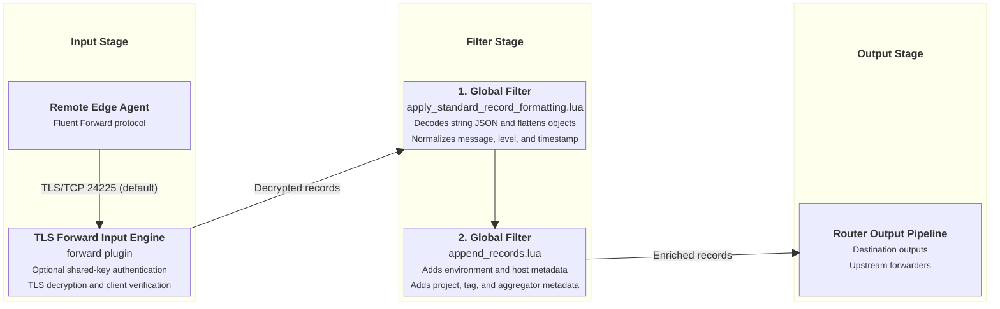

# TLS Forward Ingestion Input

This document details the TLS-encrypted Forward ingestion input supported by `fluent-bit-router`.

---

## Overview

The TLS Forward input plugin listens for encrypted Fluent binary Forward connections with optional shared key authentication and certificate verification. It is designed for secure log collection across untrusted networks or cloud infrastructure.

---

## Configuration Reference

### Environment Variables

| Variable                       | Description                                                 | Default                 |
| ------------------------------ | ----------------------------------------------------------- | ----------------------- |
| `ENABLE_TLS_FORWARD_INPUT`     | Enable TLS Forward input plugin (`true` / `false`).         | `false`                 |
| `TLS_FORWARD_INPUT_PORT`       | Listen port for TLS Forward connections.                    | `24225`                 |
| `TLS_FORWARD_INPUT_SHARED_KEY` | Secret key shared with remote forwarder.                    | _(empty)_               |
| `TLS_FORWARD_INPUT_VERIFY`     | Verify client certificates (`on` / `off`).                  | `off`                   |
| `CERTIFICATES_DIRECTORY`       | Directory where TLS certificates (`fluent-bit.pem`) reside. | `/etc/fluent-bit/certs` |

### Configuration Template

When `ENABLE_TLS_FORWARD_INPUT=true`, `entrypoint.sh` generates the following YAML block in `fluent-bit.tls-forward.input.yaml`:

```yaml
pipeline:
  inputs:
    - name: forward
      listen: 0.0.0.0
      port: ${TLS_FORWARD_INPUT_PORT}
      shared_key: ${TLS_FORWARD_INPUT_SHARED_KEY}
      self_hostname: ${HOST_HOSTNAME}
      mem_buf_limit: 64M
      storage.type: filesystem
      storage.pause_on_chunks_overlimit: on
      buffer_chunk_size: 5M
      buffer_max_size: 1000M
      tls: on
      tls.verify: ${TLS_FORWARD_INPUT_VERIFY}
      tls.key_file: ${CERTIFICATES_DIRECTORY}/fluent-bit.pem
      tls.crt_file: ${CERTIFICATES_DIRECTORY}/fluent-bit.pem
      threaded: ${ENABLE_THREADED_INPUTS:-false}
```

---

## Ingestion & Filtering Flow Diagram



---

## Applied Filters

### 1. Global Core Filters

Logs received via TLS Forward pass through all global core filters:

- **[`apply_standard_record_formatting.lua`](input-global-filters.md#1-core-record-formatting-filter-apply_standard_record_formattinglua)**: Decodes string JSON, normalizes `message`, flattens nested objects, converts `source.` keys to `source_`, and normalizes level/timestamp.
- **[`append_records.lua`](input-global-filters.md#2-environmental-metadata-enrichment-filter-append_recordslua)**: Appends `source_env`, `source_hostname`, `source_project`, `source_tag`, and `source_aggregator`.
