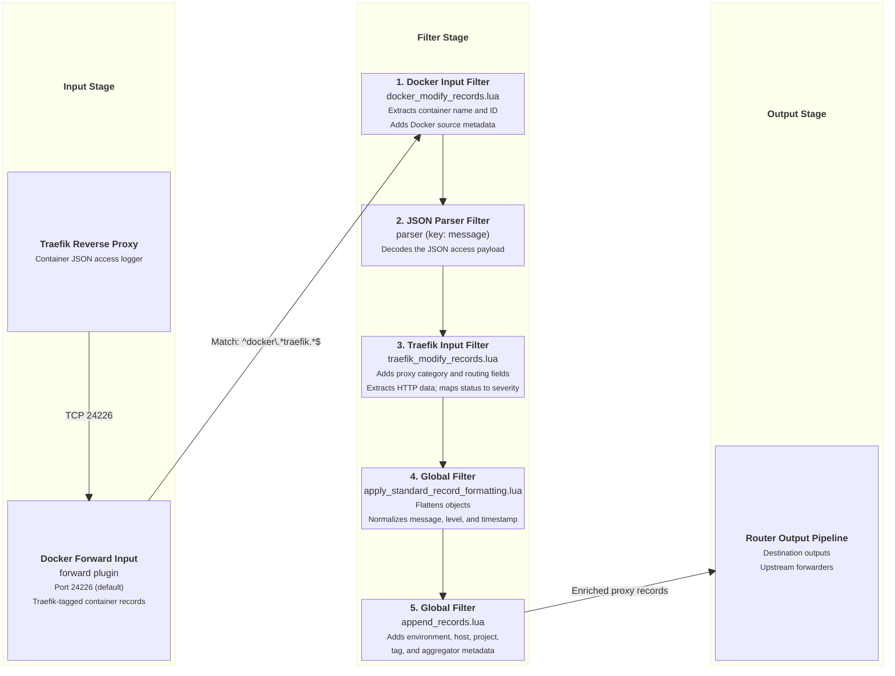

# Traefik Reverse Proxy Access Log Ingestion

This document details how `fluent-bit-router` parses, normalizes, and enriches access logs generated by Traefik reverse proxy containers.

---

## Overview

When running alongside Traefik reverse proxy containers (configured with JSON access logging), `fluent-bit-router` automatically parses JSON log attributes, maps status codes to standard severity levels (`info`, `warn`, `error`), extracts HTTP client IP addresses, request paths, HTTP methods, duration, and router/service identifiers, tagging all records with `source_category = "proxy"`.

---

## Ingestion & Filtering Flow Diagram



---

## Applied Filters & Record Mutations

### Traefik Record Formatting (`traefik_modify_records.lua`)

Runs on container logs matching `^docker\.*traefik.*$`:

- **Category Tagging**: Sets `source_category = "proxy"`.
- **Service Tagging**: Sets `source_service = "proxy"` (unless custom service name present).
- **JSON Inspection Fallback**: The preceding parser normally exposes access-log fields directly. If `message` is still a JSON string, the Lua filter decodes it as a local read-only view and retains the string for the global formatter, avoiding loss of empty-array identity at a Lua-filter boundary.
- **Client IP Extraction**: Extracts `ClientAddr` or `ClientHost` to `source_client_ip` (stripping port number).
- **HTTP Metadata**: Maps `RequestMethod` to `source_http_method`, `RequestPath` to `source_http_path`, and `DownstreamStatus` to `source_http_status`.
- **Severity Mapping**:
  - Status `>= 500` -> `level = "error"`, `levelname = "error"`
  - Status `>= 400` -> `level = "warn"`, `levelname = "warn"`
  - Status `< 400` -> `level = "info"`, `levelname = "info"`
- **Proxy Routing Identifiers**: Maps `RouterName` -> `source_proxy_router` and `ServiceName` -> `source_proxy_service`.

---

## Verification & Testing

Launch a test Traefik access log payload via container logger:

```bash
docker run --rm \
  --log-driver=fluentd \
  --log-opt fluentd-address=127.0.0.1:24226 \
  --log-opt tag="proxy-traefik" \
  alpine echo '{"ClientAddr":"192.168.1.50:52341","RequestMethod":"GET","RequestPath":"/api/health","DownstreamStatus":200,"Duration":1250300,"RouterName":"api-router@docker"}'
```

Verify in container logs (`docker logs -f fluent-bit-router`) that `source_category="proxy"`, `source_client_ip="192.168.1.50"`, `source_http_status=200`, and `level="info"` are populated.
