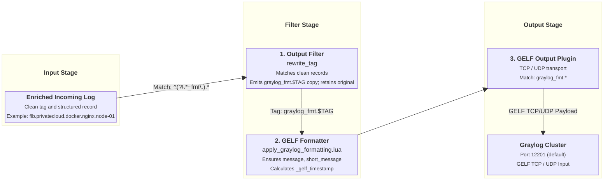

# Graylog GELF Output Integration

This document details how `fluent-bit-router` formats, mutates, and forwards log streams to Graylog using the Graylog Extended Log Format (GELF) plugin.

---

## Overview & Architecture

Graylog GELF is a structured logging format designed to carry rich metadata, full text messages, short summaries, and millisecond/microsecond timestamp precision.

`fluent-bit-router` handles Graylog GELF output through a dedicated two-stage pipeline:

1. **Stream Duplication (`rewrite_tag`)**: Creates a dedicated parallel copy of incoming records tagged `graylog_fmt.<TAG>`.
2. **GELF Formatting Filter (`apply_graylog_formatting.lua`)**:
   - Guarantees `message` and `short_message` are never empty (falling back to `"NO MESSAGE"` if absent).
   - Generates `_gelf_timestamp` from Fluent Bit's high-resolution `{sec, nsec}` event time table.
   - Maps the normalized `source` host identifier to the GELF `host` field.

---

## Pipeline Execution Flow



---

## Configuration Reference

### Environment Variables

| Variable                                       | Description                                                           | Default   |
| ---------------------------------------------- | --------------------------------------------------------------------- | --------- |
| `ENABLE_GRAYLOG_GELF_OUTPUT`                   | Enable Graylog GELF output (`true` / `false`).                        | `false`   |
| `GRAYLOG_GELF_HOST`                            | Hostname or IP address of Graylog instance. **(Required if enabled)** | _(empty)_ |
| `GRAYLOG_GELF_PORT`                            | Port of Graylog GELF input.                                           | `12201`   |
| `GRAYLOG_GELF_MODE`                            | Network transport protocol (`tcp` / `udp`).                           | `tcp`     |
| `GRAYLOG_GELF_BUFFER_STORAGE_TOTAL_LIMIT_SIZE` | Filesystem queue limit for Graylog output buffer.                     | `2G`      |
| `GRAYLOG_GELF_RETRY_LIMIT`                     | Maximum retries before dropping failed GELF chunk.                    | `6`       |

### Generated Configuration Template

When `ENABLE_GRAYLOG_GELF_OUTPUT=true`, `entrypoint.sh` appends the following YAML block in `fluent-bit.graylog-gelf.output.yaml`:

```yaml
pipeline:
  filters:
    # Create a copy of the logs to be formatted before shipping to Graylog
    - name: rewrite_tag
      match_regex: ^(?!.*_fmt\.).*
      rule: $message .* graylog_fmt.$TAG true
      emitter_name: emitter_graylog
      emitter_storage.type: filesystem
      emitter_mem_buf_limit: 64M
    # Ensure required fields are extracted and formatted for Graylog
    - name: lua
      match: "graylog_fmt.*"
      script: apply_graylog_formatting.lua
      call: graylog_formatting
      time_as_table: true

  outputs:
    # Graylog GELF output
    - name: gelf
      match: "graylog_fmt.*"
      host: ${GRAYLOG_GELF_HOST}
      port: ${GRAYLOG_GELF_PORT}
      mode: ${GRAYLOG_GELF_MODE}
      compress: false
      gelf_timestamp_key: _gelf_timestamp
      gelf_short_message_key: message
      gelf_full_message_key: message
      gelf_host_key: source
      storage.total_limit_size: ${GRAYLOG_GELF_BUFFER_STORAGE_TOTAL_LIMIT_SIZE}
      retry_limit: ${GRAYLOG_GELF_RETRY_LIMIT}
```

---

## GELF Formatting & Record Mutations

Graylog requires certain mandatory fields in every GELF payload:

1. **`short_message`**: Short summary string. [`apply_graylog_formatting.lua`](../docker/overlay/etc/fluent-bit/apply_graylog_formatting.lua) ensures this field is populated from `message` or sets `"NO MESSAGE"` if missing.
2. **`full_message`**: Full log message text. Mapped from `message`.
3. **`host`**: Origin host name or identifier. Mapped from the normalized `source` record key.
4. **`timestamp`**: Seconds since UNIX epoch with decimal fractional seconds. [`apply_graylog_formatting.lua`](../docker/overlay/etc/fluent-bit/apply_graylog_formatting.lua) computes `_gelf_timestamp = sec + (nsec / 1e9)` from Fluent Bit's internal high-resolution timestamp table without mutating the original application timestamp.

All other fields in the record (e.g. `service_name`, `source_category`, `source_env`, `source_container_name`, `level`) are forwarded as additional indexed custom fields (e.g. `_service_name`, `_source_category`) in Graylog.

---

## Retry Policy & Failure Modes

### Retry Behavior (`GRAYLOG_GELF_RETRY_LIMIT=6`)

By default, the Graylog GELF output plugin is configured with `retry_limit: 6`.

$$\text{Retry Timeline: } 5\text{s} \to 10\text{s} \to 20\text{s} \to 40\text{s} \to 80\text{s} \to 160\text{s} \approx \mathbf{5\text{ minutes}}$$

#### Why `6` is a Sensible Default:

1. **Network Glitches & Service Restarts**: 6 retries with exponential backoff covers ~5 minutes of Graylog service restarts or container upgrades without dropping logs.
2. **Index Block Protection**: If Graylog's backend Elasticsearch / OpenSearch cluster enters a disk watermark lock (`read-only-allow-delete` / Red cluster state), Graylog pauses or drops GELF inputs. A bounded retry limit of 6 prevents Fluent Bit's filesystem storage queue from accumulating indefinite backpressure on upstream syslog sources.
