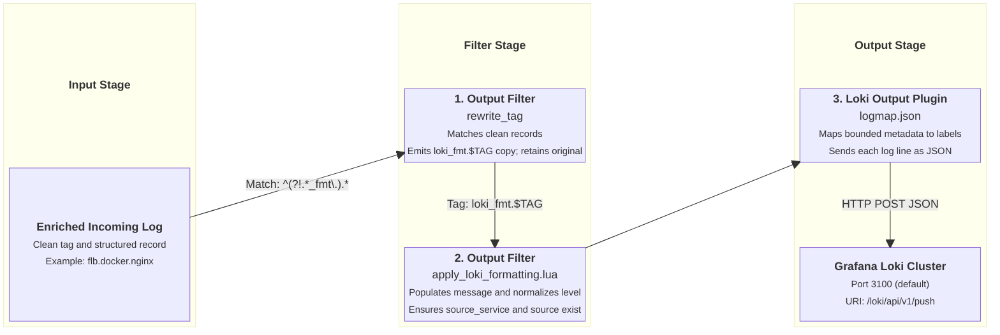

# Grafana Loki Output Integration

This document details how `fluent-bit-router` formats, mutates, and pushes log streams to Grafana Loki using the Loki HTTP push API.

---

## Overview & Architecture

Grafana Loki ingests log lines as JSON or raw text paired with key-value labels. To prevent excessive memory consumption and index degradation in Loki, label cardinality must be strictly controlled.

`fluent-bit-router` handles Loki output through a two-stage pipeline:

1. **Stream Duplication (`rewrite_tag`)**: Creates a dedicated parallel copy of incoming records tagged `loki_fmt.<TAG>`.
2. **Label Mapping (`logmap.json`)**: Converts selected normalized record metadata fields into top-level Loki indexed labels.

---

## Pipeline Execution Flow



---

## Configuration Reference

### Environment Variables

| Variable                     | Description                                              | Default             |
| ---------------------------- | -------------------------------------------------------- | ------------------- |
| `ENABLE_GRAFANA_LOKI_OUTPUT` | Enable Grafana Loki HTTP push output (`true` / `false`). | `false`             |
| `GRAFANA_LOKI_HOST`          | Hostname or IP address of Grafana Loki instance.         | _(empty)_           |
| `GRAFANA_LOKI_PORT`          | Port of Grafana Loki instance.                           | `3100`              |
| `GRAFANA_LOKI_URI`           | HTTP push endpoint URI.                                  | `/loki/api/v1/push` |

### Generated Configuration Template

When `ENABLE_GRAFANA_LOKI_OUTPUT=true`, `entrypoint.sh` appends the following YAML block to `fluent-bit.yaml`:

```yaml
pipeline:
  filters:
    - name: rewrite_tag
      match_regex: ^(?!.*_fmt\.).*
      rule: $message .* loki_fmt.$TAG true
      emitter_name: emitter_loki
      emitter_storage.type: filesystem
      emitter_mem_buf_limit: 64M

  outputs:
    - name: loki
      match: "loki_fmt.*"
      host: ${GRAFANA_LOKI_HOST}
      port: ${GRAFANA_LOKI_PORT}
      uri: ${GRAFANA_LOKI_URI}
      tls: off
      labels: input=flb
      label_map_path: /tmp/fluent-bit-custom/fluent-bit.grafana-loki.output.logmap.json
      line_format: json
```

---

## Label Mapping & Mutations

Loki labels control how log streams are indexed and queried in Grafana. `fluent-bit-router` uses `/etc/fluent-bit/fluent-bit.grafana-loki.output.logmap.json` to map record fields to Loki labels:

### `logmap.json` Definition

```json
{
  "source_service": "service_name",
  "source_category": "category",
  "source_env": "environment",
  "source_hostname": "hostname",
  "source_project": "project",
  "source_region": "region",
  "levelname": "level"
}
```

### Extracted Loki Labels Summary

| Record Field      | Loki Label Name | Description                                          | Example                             |
| ----------------- | --------------- | ---------------------------------------------------- | ----------------------------------- |
| `source_service`  | `service_name`  | Name of the service, systemd unit, or Swarm service. | `nginx`, `authlog`, `systemd`       |
| `source_category` | `category`      | High-level log category.                             | `docker`, `system`, `auth`, `audit` |
| `source_env`      | `environment`   | Deployment environment.                              | `production`, `homelab`             |
| `source_hostname` | `hostname`      | Host server node name.                               | `node-01`, `homelab-server`         |
| `source_project`  | `project`       | Infrastructure project identifier.                   | `streamingtech`                     |
| `source_region`   | `region`        | Cloud region or datacenter.                          | `us-east-1`, `local`                |
| `levelname`       | `level`         | Normalized log severity level.                       | `info`, `warn`, `error`, `debug`    |
| _(static)_        | `input`         | Static input indicator attached by output plugin.    | `flb`                               |

### Log Payload Structure in Loki

Unmapped record fields (such as `message`, `source_container_id`, `source_tag`, `source_stream`) remain inside the JSON log line payload and can be parsed at query time using LogQL (`| json`).
