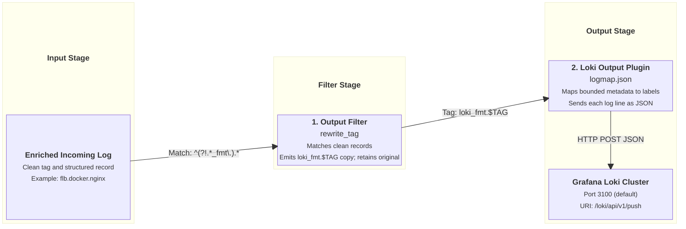

# Grafana Loki Output Integration

This document details how `fluent-bit-router` formats, mutates, and pushes log streams to Grafana Loki using the Loki HTTP push API.

---

## Overview & Architecture

Grafana Loki ingests log lines as JSON or raw text paired with key-value labels. To prevent excessive memory consumption and index degradation in Loki, label cardinality must be strictly controlled.

`fluent-bit-router` handles Loki output through a two-stage pipeline:

1. **Stream Duplication (`rewrite_tag`)**: Creates a dedicated parallel copy of incoming records tagged `loki_fmt.<TAG>`.
2. **Label Mapping (`logmap.json`)**: Converts selected normalized record metadata fields into top-level Loki indexed labels.

---

## Pipeline Execution Flow



---

## Configuration Reference

### Environment Variables

| Variable                                       | Description                                              | Default             |
| ---------------------------------------------- | -------------------------------------------------------- | ------------------- |
| `ENABLE_GRAFANA_LOKI_OUTPUT`                   | Enable Grafana Loki HTTP push output (`true` / `false`). | `false`             |
| `GRAFANA_LOKI_HOST`                            | Hostname or IP address of Grafana Loki instance.         | _(empty)_           |
| `GRAFANA_LOKI_PORT`                            | Port of Grafana Loki instance.                           | `3100`              |
| `GRAFANA_LOKI_URI`                             | HTTP push endpoint URI.                                  | `/loki/api/v1/push` |
| `GRAFANA_LOKI_BUFFER_STORAGE_TOTAL_LIMIT_SIZE` | Filesystem queue limit for Loki output buffer.           | `3G`                |
| `GRAFANA_LOKI_RETRY_LIMIT`                     | Maximum retries before dropping failed Loki chunk.       | `10`                |

### Generated Configuration Template

When `ENABLE_GRAFANA_LOKI_OUTPUT=true`, `entrypoint.sh` appends the following YAML block to `fluent-bit.yaml`:

```yaml
pipeline:
  filters:
    - name: rewrite_tag
      match_regex: ^(?!.*_fmt\.).*
      rule: $message .* loki_fmt.$TAG true
      emitter_name: emitter_loki
      emitter_storage.type: filesystem
      emitter_mem_buf_limit: 64M

  outputs:
    - name: loki
      match: "loki_fmt.*"
      host: ${GRAFANA_LOKI_HOST}
      port: ${GRAFANA_LOKI_PORT}
      uri: ${GRAFANA_LOKI_URI}
      tls: off
      labels: input=flb
      label_map_path: /tmp/fluent-bit-custom/fluent-bit.grafana-loki.output.logmap.json
      line_format: json
      storage.total_limit_size: ${GRAFANA_LOKI_BUFFER_STORAGE_TOTAL_LIMIT_SIZE}
      retry_limit: ${GRAFANA_LOKI_RETRY_LIMIT}
```

---

## Retry Policy, Backpressure & Loki Server `limits_config`

### Retry Behavior (`GRAFANA_LOKI_RETRY_LIMIT=10`)

By default, the Loki output plugin is configured with `retry_limit: 10`.

Fluent Bit uses an exponential backoff scheduler (`scheduler.base: 5`, `scheduler.cap: 300`):
$$\text{Retry Timeline: } 5\text{s} \to 10\text{s} \to 20\text{s} \to 40\text{s} \to 80\text{s} \to 160\text{s} \to 300\text{s} \to 300\text{s} \to 300\text{s} \to 300\text{s} \approx \mathbf{25\text{ minutes}}$$

#### Why `10` is a Sensible Default:

1. **Protection Against Poison-Pill Chunks**: Unlike simple storage sinks, Loki performs strict validation on ingested streams (e.g., label formatting, stream limits, syntax rules). If an invalid or unparseable record causes Loki to return HTTP `400 Bad Request`, an infinite retry setting (`retry_limit: false`) would cause Fluent Bit to retry the rejected chunk indefinitely, permanently stalling newer logs behind it. Bounding retries to `10` drops unrecoverable chunks after ~25 minutes while continuing healthy streams.
2. **Standard Maintenance Survival**: 25 minutes of retries is sufficient to survive routine container updates, cluster reboots, and transient network blips without log loss.

#### Surviving Extended Multi-Hour Outages (`retry_limit: false`):

If your deployment prioritizes zero log loss for search indexing even during extended outages (e.g., Loki stopped for 5+ hours), set:

```bash
GRAFANA_LOKI_RETRY_LIMIT=false
```

When set to `false`, Fluent Bit retries every 5 minutes indefinitely, persisting failed chunks on disk (`storage.type filesystem`) up to `GRAFANA_LOKI_BUFFER_STORAGE_TOTAL_LIMIT_SIZE`. Once the buffer fills, the router exerts backpressure on edge FB sources to hold logs on edge host disks until Loki is restored.

---

### Required Loki Server Settings for Catch-Up

When Loki recovers from a multi-hour outage and the router drains its queued backlog, Loki must be configured on the server side to accept delayed log entries and handle ingestion bursts.

In your Loki server configuration (`local-config.yaml` / `loki.yaml`), ensure the `limits_config` block includes:

```yaml
limits_config:
  # 1. Allow delayed/replayed historical logs (must be longer than maximum expected outage)
  reject_old_samples: true
  reject_old_samples_max_age: 7d # or 168h (default in grafana-docker-swarm)

  # 2. Allow high throughput burst during backlog catch-up
  ingestion_rate_mb: 100
  ingestion_burst_size_mb: 200
  per_stream_rate_limit: 100M
  per_stream_rate_limit_burst: 200M

  # 3. Increase query & series limits for replayed volume
  cardinality_limit: 500000
  max_entries_limit_per_query: 1000000
```

> [!TIP]
> **Production Stack Reference**:
> The [Grafana Docker Swarm Repository](https://github.com/Josh5/grafana-docker-swarm) stack template (`docker-compose.grafana-stack.yml`) configures `reject_old_samples_max_age: 7d` and `ingestion_burst_size_mb: 200` by default via `LOKI_REJECT_OLD_SAMPLES_MAX_AGE=7d`, ensuring seamless catch-up for multi-day backlogs.

---

## Label Mapping & Mutations

Loki labels control how log streams are indexed and queried in Grafana. The image ships `/etc/fluent-bit/fluent-bit.grafana-loki.output.logmap.json`; the entrypoint copies it into the generated configuration directory at runtime and uses it to map record fields to Loki labels.

Every unique combination of label values creates a separate Loki stream. The environment labels are appropriate here because they represent bounded, long-lived deployment identity:

- `source_env_type` has very low cardinality, normally values such as `homelab`, `test`, `staging`, or `production`.
- `source_env_region` comes from a bounded set of cloud-provider or physical regions.
- `source_env_isolation_scope` identifies the security and credential-sharing boundary within which infrastructure may safely share access and blast radius.

These labels make it efficient to select a blast radius before filtering log content. Their combined values should remain stable for the lifetime of an environment. Because they are normally constant for a host and `source_hostname` already separates host streams, adding them should not materially split an individual host/service stream further. Changing a value on a running environment does create a new stream boundary.

The map defines eleven record-derived labels plus the static `input` label, which is below Loki's default limit of 15 index labels. Staying below that limit does not by itself guarantee safe cardinality; value stability remains the important constraint.

`service_project` is an optional source-provided label identifying the logical software project or codebase from which a workload originates. Multiple services may share the same project. It must be supplied by the workload at the log source; the router does not infer or append it.

Do not extend the label map with unbounded or short-lived fields such as `source_instance_id`, container or task IDs, request or trace IDs, client IP addresses, request paths, or timestamps. Those fields remain in the JSON log payload and can be filtered with LogQL after selecting a stream.

`source_hostname` and `source` are useful for the current small, comparatively stable fleets, but they are the highest-cardinality labels in this map. Review them before using this configuration with large autoscaling or highly ephemeral fleets.

See Grafana's [Loki cardinality guidance](https://grafana.com/docs/loki/latest/get-started/labels/cardinality/) for methods to analyze label cardinality and recognize stream growth.

### `logmap.json` Definition

```json
{
  "log_type": "log_type",
  "levelname": "level",
  "metric_name": "metric_name",
  "service_project": "service_project",
  "service_name": "service_name",
  "source_env": "source_env",
  "source_env_type": "source_env_type",
  "source_env_region": "source_env_region",
  "source_env_isolation_scope": "source_env_isolation_scope",
  "source_hostname": "source_hostname",
  "source": "source"
}
```

### Extracted Loki Labels Summary

| Record Field                 | Loki Label Name              | Description                                                              | Example                              |
| ---------------------------- | ---------------------------- | ------------------------------------------------------------------------ | ------------------------------------ |
| `log_type`                   | `log_type`                   | Normalized log category or type when present.                            | `docker`, `system`, `audit`          |
| `levelname`                  | `level`                      | Canonical normalized log severity.                                       | `trace`, `info`, `critical`, `fatal` |
| `metric_name`                | `metric_name`                | Metric identity when the record represents a metric.                     | `request_duration`                   |
| `service_project`            | `service_project`            | Logical software project or codebase producing the workload.             | `my-app`                             |
| `service_name`               | `service_name`               | Application, systemd unit, or normalized service.                        | `nginx`, `sshd.service`              |
| `source_env`                 | `source_env`                 | Logical environment name.                                                | `platform-primary`                   |
| `source_env_type`            | `source_env_type`            | Lifecycle or deployment class.                                           | `homelab`, `test`, `production`      |
| `source_env_region`          | `source_env_region`          | Cloud-provider or physical region.                                       | `us-east-1`, `nz`                    |
| `source_env_isolation_scope` | `source_env_isolation_scope` | Security and credential-sharing boundary.                                | `staging-2026-03-08`                 |
| `source_hostname`            | `source_hostname`            | Host server node name.                                                   | `node-01`, `homelab-server`          |
| `source`                     | `source`                     | Stable origin class (`host` for host logs, `docker` for container logs). | `host`, `docker`                     |
| _(static)_                   | `input`                      | Static input indicator attached by output plugin.                        | `flb`                                |

For example, select an environment boundary first and then filter its JSON payload:

```logql
{source_env_isolation_scope="staging-2026-03-08", source_env_type="staging", source_env_region="us-east-1"}
  | json
  | source_container_id="abc123"
```

### Log Payload Structure in Loki

Unmapped record fields such as `message`, `source_container_id`, `source_routing_tag`, and `source_stream` remain inside the JSON log line payload and can be parsed at query time using LogQL (`| json`).

---

## Related Swarm Deployments

For deploying Grafana and Loki on Docker Swarm, refer to the [Grafana Docker Swarm Repository](https://github.com/Josh5/grafana-docker-swarm).
