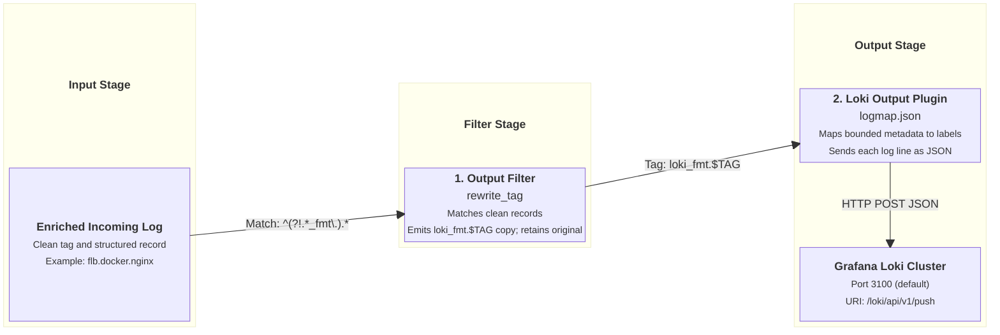

# Grafana Loki Output Integration

This document details how `fluent-bit-router` formats, mutates, and pushes log streams to Grafana Loki using the Loki HTTP push API.

---

## Overview & Architecture

Grafana Loki ingests log lines as JSON or raw text paired with key-value labels. To prevent excessive memory consumption and index degradation in Loki, label cardinality must be strictly controlled.

`fluent-bit-router` handles Loki output through a two-stage pipeline:

1. **Stream Duplication (`rewrite_tag`)**: Creates a dedicated parallel copy of incoming records tagged `loki_fmt.<TAG>`.
2. **Label Mapping (`logmap.json`)**: Converts selected normalized record metadata fields into top-level Loki indexed labels.

---

## Pipeline Execution Flow



---

## Configuration Reference

### Environment Variables

| Variable                     | Description                                              | Default             |
| ---------------------------- | -------------------------------------------------------- | ------------------- |
| `ENABLE_GRAFANA_LOKI_OUTPUT` | Enable Grafana Loki HTTP push output (`true` / `false`). | `false`             |
| `GRAFANA_LOKI_HOST`          | Hostname or IP address of Grafana Loki instance.         | _(empty)_           |
| `GRAFANA_LOKI_PORT`          | Port of Grafana Loki instance.                           | `3100`              |
| `GRAFANA_LOKI_URI`           | HTTP push endpoint URI.                                  | `/loki/api/v1/push` |

### Generated Configuration Template

When `ENABLE_GRAFANA_LOKI_OUTPUT=true`, `entrypoint.sh` appends the following YAML block to `fluent-bit.yaml`:

```yaml
pipeline:
  filters:
    - name: rewrite_tag
      match_regex: ^(?!.*_fmt\.).*
      rule: $message .* loki_fmt.$TAG true
      emitter_name: emitter_loki
      emitter_storage.type: filesystem
      emitter_mem_buf_limit: 64M

  outputs:
    - name: loki
      match: "loki_fmt.*"
      host: ${GRAFANA_LOKI_HOST}
      port: ${GRAFANA_LOKI_PORT}
      uri: ${GRAFANA_LOKI_URI}
      tls: off
      labels: input=flb
      label_map_path: /tmp/fluent-bit-custom/fluent-bit.grafana-loki.output.logmap.json
      line_format: json
```

---

## Label Mapping & Mutations

Loki labels control how log streams are indexed and queried in Grafana. The image ships `/etc/fluent-bit/fluent-bit.grafana-loki.output.logmap.json`; the entrypoint copies it into the generated configuration directory at runtime and uses it to map record fields to Loki labels.

Every unique combination of label values creates a separate Loki stream. The environment labels are appropriate here because they represent bounded, long-lived deployment identity:

- `source_type` has very low cardinality, normally values such as `homelab`, `test`, `staging`, or `production`.
- `source_region` comes from a bounded set of cloud-provider or physical regions.
- `source_project` is a stable cross-cloud account, subscription, tenant, and credential-isolation boundary.

These labels make it efficient to select a blast radius before filtering log content. Their combined values should remain stable for the lifetime of an environment. Because they are normally constant for a host and `source_hostname` already separates host streams, adding them should not materially split an individual host/service stream further. Changing a value on a running environment does create a new stream boundary.

The map defines ten record-derived labels plus the static `input` label, which is below Loki's default limit of 15 index labels. Staying below that limit does not by itself guarantee safe cardinality; value stability remains the important constraint.

Do not extend the label map with unbounded or short-lived fields such as `source_instance_id`, container or task IDs, request or trace IDs, client IP addresses, request paths, or timestamps. Those fields remain in the JSON log payload and can be filtered with LogQL after selecting a stream.

`source_hostname` and `source` are useful for the current small, comparatively stable fleets, but they are the highest-cardinality labels in this map. Review them before using this configuration with large autoscaling or highly ephemeral fleets.

See Grafana's [Loki cardinality guidance](https://grafana.com/docs/loki/latest/get-started/labels/cardinality/) for methods to analyze label cardinality and recognize stream growth.

### `logmap.json` Definition

```json
{
  "log_type": "log_type",
  "levelname": "level",
  "metric_name": "metric_name",
  "service_name": "service_name",
  "source_env": "source_env",
  "source_type": "source_type",
  "source_region": "source_region",
  "source_project": "source_project",
  "source_hostname": "source_hostname",
  "source": "source"
}
```

### Extracted Loki Labels Summary

| Record Field      | Loki Label Name   | Description                                          | Example                              |
| ----------------- | ----------------- | ---------------------------------------------------- | ------------------------------------ |
| `log_type`        | `log_type`        | Normalized log category or type when present.        | `docker`, `system`, `audit`          |
| `levelname`       | `level`           | Canonical normalized log severity.                   | `trace`, `info`, `critical`, `fatal` |
| `metric_name`     | `metric_name`     | Metric identity when the record represents a metric. | `request_duration`                   |
| `service_name`    | `service_name`    | Application, systemd unit, or normalized service.    | `nginx`, `sshd.service`              |
| `source_env`      | `source_env`      | Logical environment name.                            | `platform-primary`                   |
| `source_type`     | `source_type`     | Lifecycle or deployment class.                       | `homelab`, `test`, `production`      |
| `source_region`   | `source_region`   | Cloud-provider or physical region.                   | `us-east-1`, `nz`                    |
| `source_project`  | `source_project`  | Cross-cloud isolation boundary.                      | `staging-2026-03-08`                 |
| `source_hostname` | `source_hostname` | Host server node name.                               | `node-01`, `homelab-server`          |
| `source`          | `source`          | Host-aware source fallback.                          | `homelab-server`                     |
| _(static)_        | `input`           | Static input indicator attached by output plugin.    | `flb`                                |

For example, select an environment boundary first and then filter its JSON payload:

```logql
{source_project="staging-2026-03-08", source_type="staging", source_region="us-east-1"}
  | json
  | source_container_id="abc123"
```

### Log Payload Structure in Loki

Unmapped record fields such as `message`, `source_container_id`, `source_tag`, and `source_stream` remain inside the JSON log line payload and can be parsed at query time using LogQL (`| json`).
