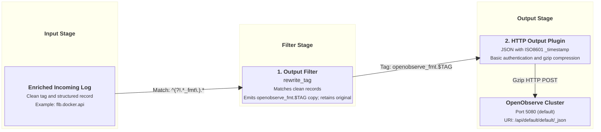

# OpenObserve Output Integration

This document details how `fluent-bit-router` streams log data to OpenObserve using its native HTTP JSON ingestion API.

---

## Overview & Architecture

OpenObserve is a cloud-native observability platform that ingests structured JSON log records over HTTP. OpenObserve uses a unified schema where timestamp records are expected under the `_timestamp` ISO8601 field.

`fluent-bit-router` handles OpenObserve ingestion via a two-stage pipeline:

1. **Stream Duplication (`rewrite_tag`)**: Creates a dedicated parallel copy of incoming log records tagged `openobserve_fmt.<TAG>`.
2. **HTTP Gzip JSON Push**: Compresses and streams JSON payloads to the configured OpenObserve HTTP endpoint with HTTP Basic Authentication.

---

## Pipeline Execution Flow



---

## Configuration Reference

### Environment Variables

| Variable                         | Description                                                  | Default                      |
| -------------------------------- | ------------------------------------------------------------ | ---------------------------- |
| `ENABLE_OPENOBSERVE_HTTP_OUTPUT` | Enable OpenObserve HTTP output (`true` / `false`).           | `false`                      |
| `OPENOBSERVE_HTTP_HOST`          | Hostname or IP address of OpenObserve instance.              | _(empty)_                    |
| `OPENOBSERVE_HTTP_PORT`          | Port of OpenObserve instance.                                | `5080`                       |
| `OPENOBSERVE_HTTP_URI`           | HTTP ingestion URI endpoint.                                 | `/api/default/default/_json` |
| `OPENOBSERVE_HTTP_TLS`           | Enable TLS/HTTPS for connection (`on` / `off`).              | `off`                        |
| `OPENOBSERVE_HTTP_USER`          | Basic authentication username (e.g. OpenObserve user email). | _(empty)_                    |
| `OPENOBSERVE_HTTP_PASSWD`        | Basic authentication password or stream authorization token. | _(empty)_                    |

### Generated Configuration Template

When `ENABLE_OPENOBSERVE_HTTP_OUTPUT=true`, `entrypoint.sh` appends the following YAML block to `fluent-bit.yaml`:

```yaml
pipeline:
  filters:
    - name: rewrite_tag
      match_regex: ^(?!.*_fmt\.).*
      rule: $message .* openobserve_fmt.$TAG true
      emitter_name: emitter_openobserve
      emitter_storage.type: filesystem
      emitter_mem_buf_limit: 64M

  outputs:
    - name: http
      match: "openobserve_fmt.*"
      host: ${OPENOBSERVE_HTTP_HOST}
      port: ${OPENOBSERVE_HTTP_PORT}
      uri: ${OPENOBSERVE_HTTP_URI}
      tls: ${OPENOBSERVE_HTTP_TLS}
      format: json
      json_date_key: _timestamp
      json_date_format: iso8601
      http_user: ${OPENOBSERVE_HTTP_USER}
      http_passwd: ${OPENOBSERVE_HTTP_PASSWD}
      compress: gzip
```

---

## Field Schema in OpenObserve

OpenObserve automatically parses and indexes all top-level JSON fields present in the log record:

| Record Field            | Description                                                | Ingested JSON Key       |
| ----------------------- | ---------------------------------------------------------- | ----------------------- |
| `timestamp`             | Epoch timestamp automatically converted to ISO8601 string. | `_timestamp`            |
| `message`               | Log message body text.                                     | `message`               |
| `source_service`        | Service name or systemd unit.                              | `source_service`        |
| `source_category`       | High-level category (`docker`, `system`, `auth`, `audit`). | `source_category`       |
| `source_container_name` | Docker container name (when category is `docker`).         | `source_container_name` |
| `source_container_id`   | Short container ID.                                        | `source_container_id`   |
| `source_stream`         | Container log stream (`stdout` / `stderr`).                | `source_stream`         |
| `source_env`            | Deployment environment name.                               | `source_env`            |
| `source_hostname`       | Host node hostname.                                        | `source_hostname`       |
| `source_project`        | Infrastructure project identifier.                         | `source_project`        |
| `level` / `levelname`   | Normalized log severity level.                             | `level` / `levelname`   |

---

## Related Swarm Deployments

For deploying OpenObserve on Docker Swarm, refer to the [OpenObserve Docker Swarm Repository](https://github.com/Josh5/openobserve-docker-swarm).
