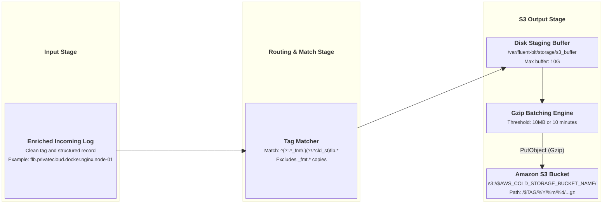

# AWS S3 Cold Storage Output Integration

This document details how `fluent-bit-router` batches, compresses, and archives log streams to Amazon S3 (or S3-compatible object storage) for durable long-term cold storage.

---

## Overview & Architecture

The AWS S3 output plugin streams enriched, clean log records directly to Amazon S3 buckets. Logs are buffered locally on the filesystem, batched into gzip-compressed `.txt.gz` archive objects, and organized by hierarchical S3 key paths partitioned by tag and date.

`fluent-bit-router` handles S3 cold storage through a dedicated output pipeline:

1. **Tag Isolation Matcher**: Matches all original, clean incoming logs matching the base prefix (`^(?!.*_fmt\.)(?!.*cld_st)${FLUENT_BIT_TAG_PREFIX}.*`) while strictly excluding internal `_fmt.` database formatting copies and preventing archival loops.
2. **Local Disk Staging Buffer**: Batches logs in `${FLUENT_STORAGE_PATH}/s3_buffer` up to `AWS_COLD_STORAGE_BUFFER_STORE_DIR_LIMIT_SIZE` (default `10G`).
3. **Timed & Sized Flushes**: Flushes gzip-compressed files to S3 whenever a batch reaches **10MB** or when the **10-minute** idle timeout is reached.
4. **Hierarchical Key Partitioning**: Stores objects in the format `/$TAG/%Y/%m/%d/%H_%M_%S-$UUID.txt.gz`, creating clean date-partitioned folder structures for Amazon Athena, S3 Select, or archival retrieval.

---

## Pipeline Execution Flow



---

## Configuration Reference

### Environment Variables

| Variable                                       | Description                                                      | Default   |
| ---------------------------------------------- | ---------------------------------------------------------------- | --------- |
| `ENABLE_S3_BUCKET_COLD_STORAGE_OUTPUT`         | Enable AWS S3 cold storage output (`true` / `false`).            | `false`   |
| `AWS_COLD_STORAGE_BUCKET_NAME`                 | Target Amazon S3 bucket name. **(Required if enabled)**          | _(empty)_ |
| `AWS_COLD_STORAGE_BUCKET_REGION`               | AWS Region hosting the bucket (e.g. `us-east-1`). **(Required)** | _(empty)_ |
| `AWS_COLD_STORAGE_BUFFER_STORE_DIR_LIMIT_SIZE` | Filesystem queue limit for S3 staging buffer directory.          | `10G`     |
| `AWS_COLD_STORAGE_RETRY_LIMIT`                 | Maximum retries before dropping failed S3 chunk.                 | `5`       |

### Generated Configuration Template

When `ENABLE_S3_BUCKET_COLD_STORAGE_OUTPUT=true`, `entrypoint.sh` appends the following YAML block in `fluent-bit.s3-cold-storage.output.yaml`:

```yaml
pipeline:
  outputs:
    # S3 Bucket cold storage output
    - name: s3
      match_regex: ^(?!.*_fmt\.)(?!.*cld_st)${FLUENT_BIT_TAG_PREFIX}.*
      bucket: ${AWS_COLD_STORAGE_BUCKET_NAME}
      region: ${AWS_COLD_STORAGE_BUCKET_REGION}
      total_file_size: 10M
      s3_key_format: /$TAG/%Y/%m/%d/%H_%M_%S-$UUID.txt.gz
      use_put_object: On
      compression: gzip
      store_dir: /var/fluent-bit/storage/s3_buffer
      store_dir_limit_size: ${AWS_COLD_STORAGE_BUFFER_STORE_DIR_LIMIT_SIZE}
      upload_timeout: 10m
      retry_limit: ${AWS_COLD_STORAGE_RETRY_LIMIT}
```

---

## AWS Authentication & IAM Credentials

Fluent Bit's native `s3` plugin uses the official AWS C SDK (`aws-c-auth`), automatically evaluating the standard AWS credential chain in the following order:

### 1. EC2 Instance Metadata (IAM Instance Profile) — Recommended

If `fluent-bit-router` runs on an Amazon EC2 instance with an attached IAM Instance Profile / Role, Fluent Bit automatically obtains temporary STS credentials via the Instance Metadata Service (IMDSv2 / IMDSv1).

- **No credentials or secrets need to be passed into the container.**

### 2. Amazon ECS Task IAM Roles

If deployed as an ECS Task, Fluent Bit automatically detects `AWS_CONTAINER_CREDENTIALS_RELATIVE_URI` or `AWS_CONTAINER_CREDENTIALS_FULL_URI` provided by the ECS agent.

### 3. Amazon EKS / Kubernetes IRSA (IAM Roles for Service Accounts)

If deployed on EKS, Fluent Bit detects `AWS_ROLE_ARN` and `AWS_WEB_IDENTITY_TOKEN_FILE` to assume the specified IAM role automatically.

### 4. Static IAM Credentials & STS Session Tokens

If passing static credentials or temporary STS session tokens via container environment variables, supply:

```bash
AWS_ACCESS_KEY_ID="AKIA..."
AWS_SECRET_ACCESS_KEY="..."
# Optional temporary STS session token:
AWS_SESSION_TOKEN="..."
```

Docker passes these variables directly into the container, where Fluent Bit's AWS SDK picks them up.

---

## S3 IAM Policy Requirements

The IAM Role or user credentials must have minimum write permissions to the destination S3 bucket:

```json
{
  "Version": "2012-10-17",
  "Statement": [
    {
      "Effect": "Allow",
      "Action": ["s3:PutObject"],
      "Resource": "arn:aws:s3:::<AWS_COLD_STORAGE_BUCKET_NAME>/*"
    }
  ]
}
```

_(Optional: If bucket KMS encryption is enabled, include `kms:GenerateDataKey` and `kms:Decrypt` permissions for the associated KMS Key ARN)._

---

## Batching, Compression & S3 Key Layout

### S3 Key Structure

Uploaded files are formatted with the following pattern:

```
s3://<bucket>/<TAG>/<YYYY>/<MM>/<DD>/<HH>_<MM>_<SS>-<UUID>.txt.gz
```

**Example Paths in S3**:

- `s3://my-log-archive/flb.privatecloud.docker.nginx.node-01/2026/08/21/02_00_00-a1b2c3d4.txt.gz`
- `s3://my-log-archive/flb.privatecloud.node.log.systemd.node-01/2026/08/21/02_10_00-e5f6g7h8.txt.gz`

### Flushing & Batching Semantics

- **`total_file_size: 10M`**: Staged data in `${FLUENT_STORAGE_PATH}/s3_buffer` is flushed as soon as 10MB of uncompressed logs accumulate.
- **`upload_timeout: 10m`**: In low-traffic environments, staged logs are flushed to S3 at least every 10 minutes to guarantee timely archiving.
- **`use_put_object: On`**: Uses standard S3 `PutObject` for fast, atomic, single-request uploads of gzip-compressed payloads without multi-part upload state overhead.
- **`compression: gzip`**: Reduces network bandwidth and S3 storage costs by 80–90%.

---

## Retry Policy & Failure Handling

### Retry Behavior (`AWS_COLD_STORAGE_RETRY_LIMIT=5`)

By default, the S3 output plugin is configured with `retry_limit: 5`.

$$\text{Retry Timeline: } 5\text{s} \to 10\text{s} \to 20\text{s} \to 40\text{s} \to 80\text{s} \approx \mathbf{2.5\text{ minutes}}$$

#### Why `5` is a Sensible Default:

1. **Handles Transient Network & Throttling Errors**: Covers temporary network disconnections, S3 `500 Internal Server Error`, or `503 SlowDown` rate limits.
2. **Prevents Disk Deadlock on Permanent Auth Failures**: If permanent configuration errors occur (such as an invalid IAM policy, non-existent bucket name, expired credentials, or missing KMS permissions), an infinite retry loop would permanently stall the local `s3_buffer` directory and exhaust disk space. Bounding retries to `5` fails fast and alerts operators via error logs.
