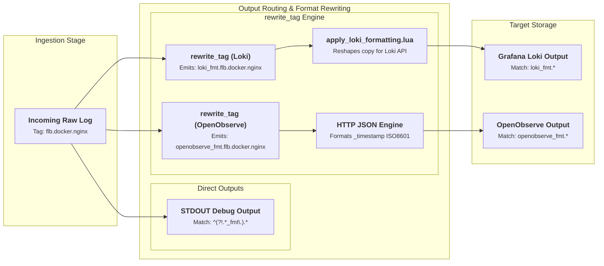

# Log Routing & Forwarding Architecture

This document details how `fluent-bit-router` routes incoming log streams, handles rich tagging, isolates internal database formatting copies, and forwards log data to upstream collectors via Plaintext or TLS-encrypted Forward protocols.

---

## Routing Principles & Tag Architecture

`fluent-bit-router` uses a multi-tier tagging strategy to decouple log ingestion enrichment from output-specific formatting and upstream network forwarding.

### 1. Rich Tag Structure

Logs arriving at an input or generated on the local node receive a structured tag. This tag captures provenance details such as environment, node category, service, and hostname:

```
[FLUENT_BIT_TAG_PREFIX].[INFRASTRUCTURE_PROVIDER].[LOG_CATEGORY].[SERVICE_OR_UNIT].[HOSTNAME]

Examples:
- flb.privatecloud.docker.nginx.node-01
- flb.aws.node.log.systemd.ec2-worker-02
- flb.azure.node.log.auth.azure-vm-03
```

During ingestion filtering, the core Lua formatter ([`apply_standard_record_formatting.lua`](../docker/overlay/etc/fluent-bit/apply_standard_record_formatting.lua)) saves the full tag into the log record as `source_tag`. This ensures downstream storage backends (such as Loki or OpenObserve) retain complete auditability of the log's origin.

> [!TIP]
> **Single Node Connection Debugging (`stdout_debug`)**:
> If you are debugging log delivery for a specific node, prepend `stdout_debug` to its tag prefix (e.g., `stdout_debug.flb.privatecloud.docker.app`). When `ENABLE_STDOUT_OUTPUT=true`, `fluent-bit-router` matches `^(?!.*_fmt\.).*` and outputs all clean records directly to container STDOUT, allowing real-time connection and payload auditing.

### 2. Output Matching & Filter Isolation

To prevent database-specific formatting filters (such as Loki or Graylog converters) from corrupting the raw log records forwarded upstream, `fluent-bit-router` uses regex tag isolation:

- **Real Log Matcher**: `^(?!.*_fmt\.).*`
  - Matches all original, clean incoming logs (including `stdout_debug` streams).
  - Used by **STDOUT debug output**, **Plaintext Forward output**, and **TLS Forward output**.
- **S3 Cold Storage Matcher**: `^(?!.*_fmt\.)(?!.*cld_st)${FLUENT_BIT_TAG_PREFIX}.*`
  - Matches clean logs originating from the base prefix while strictly excluding internal `_fmt.` rewritten copies and cold storage archive loops.
- **Database Formatted Matcher**: `loki_fmt.*`, `graylog_fmt.*`, `openobserve_fmt.*`
  - Matches temporary internal copies generated by `rewrite_tag` filters specifically for database push APIs.
  - Explicitly ignored by Forward outputs.

---

## Log Flow Topologies

### Single-Node Router Topology

In a standalone deployment, `fluent-bit-router` ingests logs, enriches them with host/container metadata, and splits the stream into formatted database copies and raw stdout debug output:



---

### Multi-Hop Edge-to-Central Forwarding Topology

In multi-node infrastructure, edge nodes (bare-metal servers, cloud VMs, or DIND containers) run `fluent-bit-router` in **Edge Agent Mode**. Edge instances collect local logs and forward them upstream to a **Central Collector instance**.

```mermaid
flowchart LR
    %% ROW 1: EDGE AGENT STAGE
    subgraph EdgeAgent [Edge Agent Node (Host / DIND)]
        subgraph EdgeInputs [Edge Log Inputs]
            A1["Docker Container"] -->|Port 24226| B1["Docker Input"]
            A2["Systemd Journal"] --> B2["Systemd Input"]
        end

        B1 --> C1
        B2 --> C1

        subgraph EdgeFilters [Enrichment Pipeline]
            C1["<b>1. Local Lua Filters</b><br><small>docker_modify_records.lua<br>systemd_modify_records.lua</small>"]
            --> C2["<b>2. Global Filters</b><br><small>append_records.lua<br>(Injects env/host/project)</small>"]
        end

        C2 --> D1

        subgraph EdgeOutput [Edge Forward Output]
            D1["<b>Forward Output (TCP/TLS)</b><br><small>Match: ^(?!.*_fmt\.).*<br>Sends clean binary stream</small>"]
        end
    end

    %% Connect Edge to Central Collector across nodes
    D1 -->|TCP Network Stream (Port 24224 / 24225)| E1

    %% ROW 2: CENTRAL COLLECTOR STAGE
    subgraph CentralCollector [Central Router Collector]
        subgraph CentralInputs [Central Input Engine]
            E1["<b>Forward Input Engine</b><br><small>Receives tag flb.node.docker intact</small>"]
        end

        E1 --> F1

        subgraph CentralFormats [Formatters & Storage Engines]
            F1["<b>rewrite_tag Engine</b><br><small>Emits loki_fmt.* & openobserve_fmt.*</small>"]
            --> F2["<b>Loki & OpenObserve Outputs</b><br><small>Ships formatted records to DBs</small>"]
        end
    end

    %% Structural layout constraints
    EdgeAgent ~~~ CentralCollector
```

---

## Upstream Forwarding Configuration

Upstream forwarding allows sending enriched log streams to remote Fluent-Bit or Fluentd collectors using the native Forward binary protocol.

### Plaintext Forward Output (`ENABLE_PT_FORWARD_OUTPUT`)

Uses unencrypted TCP protocol for high-performance internal networks or container overlay networks.

- **Enable Variable**: `ENABLE_PT_FORWARD_OUTPUT=true`
- **Host Variable**: `PT_FORWARD_OUTPUT_HOST` (IP or hostname of remote collector)
- **Port Variable**: `PT_FORWARD_OUTPUT_PORT` (Default: `24224`)

#### Generated Pipeline Configuration

```yaml
pipeline:
  outputs:
    - name: forward
      match_regex: ^(?!.*_fmt\.).*
      host: ${PT_FORWARD_OUTPUT_HOST}
      port: ${PT_FORWARD_OUTPUT_PORT}
      tls: off
```

---

### TLS Forward Output (`ENABLE_TLS_FORWARD_OUTPUT`)

Uses TLS encryption and optional shared key authentication for secure log transmission over public networks or untrusted cloud infrastructure.

- **Enable Variable**: `ENABLE_TLS_FORWARD_OUTPUT=true`
- **Host Variable**: `TLS_FORWARD_OUTPUT_HOST` (IP or hostname of remote collector)
- **Port Variable**: `TLS_FORWARD_OUTPUT_PORT` (Default: `24225`)
- **Shared Key Variable**: `TLS_FORWARD_OUTPUT_SHARED_KEY` (Secret key shared with remote collector)
- **Verification Variable**: `TLS_FORWARD_OUTPUT_VERIFY` (`on` or `off`, default `off`)

#### Generated Pipeline Configuration

```yaml
pipeline:
  outputs:
    - name: forward
      match_regex: ^(?!.*_fmt\.).*
      host: ${TLS_FORWARD_OUTPUT_HOST}
      port: ${TLS_FORWARD_OUTPUT_PORT}
      shared_key: ${TLS_FORWARD_OUTPUT_SHARED_KEY}
      tls: on
      tls.verify: ${TLS_FORWARD_OUTPUT_VERIFY}
```

---

## STDOUT Debug Output

When `ENABLE_STDOUT_OUTPUT=true` (enabled by default), all incoming clean logs matching `^(?!.*_fmt\.).*` are printed to container standard output.

```yaml
pipeline:
  outputs:
    - name: stdout
      match_regex: ^(?!.*_fmt\.).*
```

Viewing container logs with `docker logs -f fluent-bit-router` provides a real-time stream of all processed logs passing through the router.
