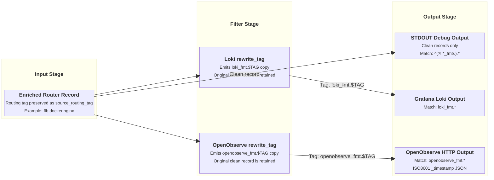
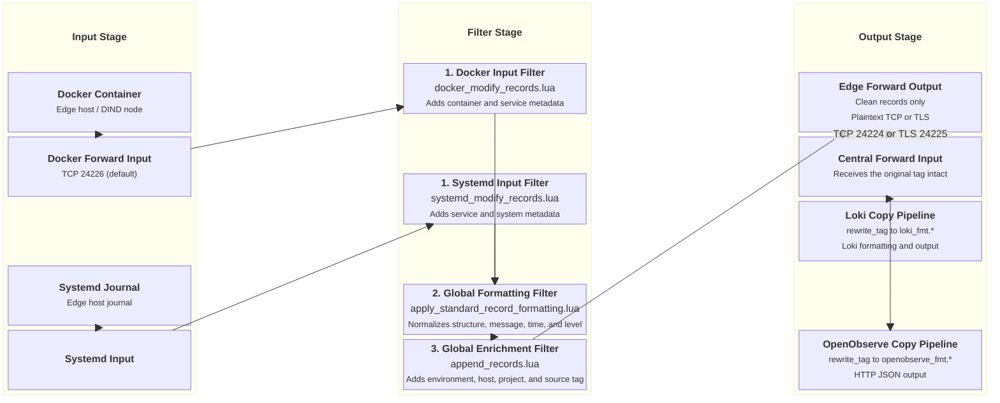

# Log Routing & Forwarding Architecture

This document details how `fluent-bit-router` routes incoming log streams, handles rich tagging, isolates internal database formatting copies, and forwards log data to upstream collectors via Plaintext or TLS-encrypted Forward protocols.

---

## Routing Principles & Tag Architecture

`fluent-bit-router` uses a multi-tier tagging strategy to decouple log ingestion enrichment from output-specific formatting and upstream network forwarding.

### 1. Rich Tag Structure

Logs arriving at an input or generated on the local node receive a structured tag. This tag captures provenance details such as environment, node category, service, and hostname:

```
[FLUENT_BIT_TAG_PREFIX].[INFRASTRUCTURE_PROVIDER].[LOG_CATEGORY].[SERVICE_OR_UNIT].[HOSTNAME]

Examples:
- flb.privatecloud.docker.nginx.node-01
- flb.aws.node.log.systemd.ec2-worker-02
- flb.azure.node.log.auth.azure-vm-03
```

During ingestion filtering, the core Lua formatter ([`apply_standard_record_formatting.lua`](../docker/overlay/etc/fluent-bit/apply_standard_record_formatting.lua)) saves the full tag into the log record as `source_routing_tag`. This ensures downstream storage backends (such as Loki or OpenObserve) retain complete auditability of the log's origin.

> [!TIP]
> **Single Node Connection Debugging (`stdout_debug`)**:
> If you are debugging log delivery for a specific node, prepend `stdout_debug` to its tag prefix (e.g., `stdout_debug.flb.privatecloud.docker.app`). When `ENABLE_STDOUT_OUTPUT=true`, `fluent-bit-router` matches `^(?!.*_fmt\.).*` and outputs all clean records directly to container STDOUT, allowing real-time connection and payload auditing.

### 2. Output Matching & Filter Isolation

To prevent database-specific formatting filters (such as Loki or Graylog converters) from corrupting the raw log records forwarded upstream, `fluent-bit-router` uses regex tag isolation:

- **Real Log Matcher**: `^(?!.*_fmt\.).*`
  - Matches all original, clean incoming logs (including `stdout_debug` streams).
  - Used by **STDOUT debug output**, **Plaintext Forward output**, and **TLS Forward output**.
- **S3 Cold Storage Matcher**: `^(?!.*_fmt\.)(?!.*cld_st)${FLUENT_BIT_TAG_PREFIX}.*`
  - Matches clean logs originating from the base prefix while strictly excluding internal `_fmt.` rewritten copies and cold storage archive loops.
- **Database Formatted Matcher**: `loki_fmt.*`, `graylog_fmt.*`, `openobserve_fmt.*`
  - Matches temporary internal copies generated by `rewrite_tag` filters specifically for database push APIs.
  - Explicitly ignored by Forward outputs.

---

## Log Flow Topologies

### Single-Node Router Topology

In a standalone deployment, `fluent-bit-router` ingests logs, enriches them with host/container metadata, and splits the stream into formatted database copies and raw stdout debug output:



---

### Multi-Hop Edge-to-Central Forwarding Topology

In multi-node infrastructure, edge nodes (bare-metal servers, cloud VMs, or DIND containers) run `fluent-bit-router` in **Edge Agent Mode**. Edge instances collect local logs and forward them upstream to a **Central Collector instance**.



---

## Upstream Forwarding Configuration

Upstream forwarding allows sending enriched log streams to remote Fluent-Bit or Fluentd collectors using the native Forward binary protocol.

### Plaintext Forward Output (`ENABLE_PT_FORWARD_OUTPUT`)

Uses unencrypted TCP protocol for high-performance internal networks or container overlay networks.

#### Environment Variables

| Variable                                            | Description                                                          | Default   |
| --------------------------------------------------- | -------------------------------------------------------------------- | --------- |
| `ENABLE_PT_FORWARD_OUTPUT`                          | Enable Plaintext Forward output plugin (`true` / `false`).           | `false`   |
| `PT_FORWARD_OUTPUT_HOST`                            | Hostname or IP address of remote collector instance.                 | _(empty)_ |
| `PT_FORWARD_OUTPUT_PORT`                            | Listen port on remote collector instance.                            | `24224`   |
| `PT_FORWARD_OUTPUT_BUFFER_STORAGE_TOTAL_LIMIT_SIZE` | Filesystem queue limit for Plaintext Forward output buffer.          | `3G`      |
| `PT_FORWARD_OUTPUT_RETRY_LIMIT`                     | Maximum retries before dropping failed chunk (`integer` or `false`). | `false`   |

#### Generated Pipeline Configuration

```yaml
pipeline:
  outputs:
    - name: forward
      match_regex: ^(?!.*_fmt\.).*
      host: ${PT_FORWARD_OUTPUT_HOST}
      port: ${PT_FORWARD_OUTPUT_PORT}
      tls: off
      time_as_integer: false
      retain_metadata_in_forward_mode: false
      require_ack_response: true
      retry_limit: ${PT_FORWARD_OUTPUT_RETRY_LIMIT:-false}
      net.connect_timeout: 10
      net.keepalive: on
      net.keepalive_idle_timeout: 120
      net.keepalive_max_recycle: 1000
      storage.total_limit_size: ${PT_FORWARD_OUTPUT_BUFFER_STORAGE_TOTAL_LIMIT_SIZE:-3G}
      workers: 1
```

---

### TLS Forward Output (`ENABLE_TLS_FORWARD_OUTPUT`)

Uses TLS encryption and optional shared key authentication for secure log transmission over public networks or untrusted cloud infrastructure.

#### Environment Variables

| Variable                                             | Description                                                          | Default   |
| ---------------------------------------------------- | -------------------------------------------------------------------- | --------- |
| `ENABLE_TLS_FORWARD_OUTPUT`                          | Enable TLS Forward output plugin (`true` / `false`).                 | `false`   |
| `TLS_FORWARD_OUTPUT_HOST`                            | Hostname or IP address of remote collector instance.                 | _(empty)_ |
| `TLS_FORWARD_OUTPUT_PORT`                            | Listen port on remote collector instance.                            | `24224`   |
| `TLS_FORWARD_OUTPUT_SHARED_KEY`                      | Secret shared key for connection handshake authentication.           | _(empty)_ |
| `TLS_FORWARD_OUTPUT_VERIFY`                          | Verify remote TLS certificates (`on` / `off`).                       | `off`     |
| `TLS_FORWARD_OUTPUT_BUFFER_STORAGE_TOTAL_LIMIT_SIZE` | Filesystem queue limit for TLS Forward output buffer.                | `3G`      |
| `TLS_FORWARD_OUTPUT_RETRY_LIMIT`                     | Maximum retries before dropping failed chunk (`integer` or `false`). | `false`   |

#### Generated Pipeline Configuration

```yaml
pipeline:
  outputs:
    - name: forward
      match_regex: ^(?!.*_fmt\.).*
      host: ${TLS_FORWARD_OUTPUT_HOST}
      port: ${TLS_FORWARD_OUTPUT_PORT}
      shared_key: ${TLS_FORWARD_OUTPUT_SHARED_KEY}
      tls: on
      tls.verify: ${TLS_FORWARD_OUTPUT_VERIFY}
      time_as_integer: false
      retain_metadata_in_forward_mode: false
      require_ack_response: true
      retry_limit: ${TLS_FORWARD_OUTPUT_RETRY_LIMIT:-false}
      net.connect_timeout: 10
      net.keepalive: on
      net.keepalive_idle_timeout: 120
      net.keepalive_max_recycle: 1000
      storage.total_limit_size: ${TLS_FORWARD_OUTPUT_BUFFER_STORAGE_TOTAL_LIMIT_SIZE:-3G}
      workers: 1
```

---

## STDOUT Debug Output

When `ENABLE_STDOUT_OUTPUT=true` (enabled by default), all incoming clean logs matching `^(?!.*_fmt\.).*` are printed to container standard output.

```yaml
pipeline:
  outputs:
    - name: stdout
      match_regex: ^(?!.*_fmt\.).*
```

Viewing container logs with `docker logs -f fluent-bit-router` provides a real-time stream of all processed logs passing through the router.

---

## Output Retry Policies & Reliability Matrix

Each destination output in `fluent-bit-router` has a purpose-built retry limit tuned for its protocol semantics and failure modes:

| Output Destination                                                                                                                              | Variable                                                             | Default `retry_limit` |    Backoff Window     | Architectural Rationale                                                                                                                                                                                                                                                                      |
| :---------------------------------------------------------------------------------------------------------------------------------------------- | :------------------------------------------------------------------- | :-------------------: | :-------------------: | :------------------------------------------------------------------------------------------------------------------------------------------------------------------------------------------------------------------------------------------------------------------------------------------- |
| **[Grafana Loki](output-loki.md)**                                                                                                              | `GRAFANA_LOKI_RETRY_LIMIT`                                           |       **`10`**        |      ~25 minutes      | **Bounded**: Protects against poison-pill chunks (Loki HTTP `400 Bad Request` on malformed labels or syntax) from stalling the pipeline forever. Can be set to `false` for zero-loss catch-up if Loki server `limits_config.reject_old_samples_max_age` is configured for multi-day windows. |
| **[OpenObserve](output-openobserve.md)**                                                                                                        | `OPENOBSERVE_HTTP_RETRY_LIMIT`                                       |      **`false`**      | Indefinite ($\infty$) | **Infinite**: OpenObserve's columnar engine dynamically schemas JSON and accepts wide timestamp ranges without rejecting batches. Infinite retries ensure zero log loss during database maintenance.                                                                                         |
| **[Graylog GELF](output-graylog.md)**                                                                                                           | `GRAYLOG_GELF_RETRY_LIMIT`                                           |        **`6`**        |     ~3–4 minutes      | **Bounded**: Prevents socket buffer exhaustion if Graylog or its underlying OpenSearch/Elasticsearch cluster enters an index-blocked or red status.                                                                                                                                          |
| **[AWS S3 Cold Storage](output-s3-cold-storage.md)**                                                                                            | `AWS_COLD_STORAGE_RETRY_LIMIT`                                       |        **`5`**        |      ~2 minutes       | **Bounded**: Retries transient S3 `500 Internal Error` or `503 SlowDown` rate limits, but prevents disk buffer exhaustion if permanent authentication (IAM credentials, KMS keys, or wrong bucket name) fails.                                                                               |
| **Inter-Node Forward** ([TLS](#tls-forward-output-enable_tls_forward_output) & [Plaintext](#plaintext-forward-output-enable_pt_forward_output)) | `TLS_FORWARD_OUTPUT_RETRY_LIMIT`<br/>`PT_FORWARD_OUTPUT_RETRY_LIMIT` |      **`false`**      | Indefinite ($\infty$) | **Infinite**: Inter-node Fluent Bit Forward protocol connections must never drop logs during central collector upgrades or network link downtime; logs remain safely persisted on edge node disks until delivery succeeds.                                                                   |
